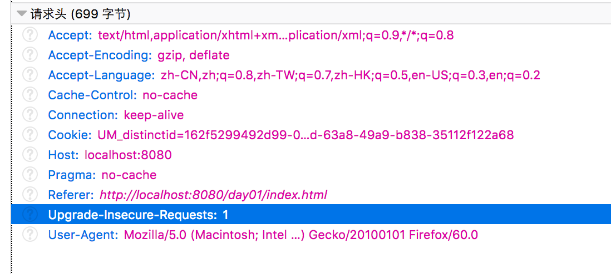
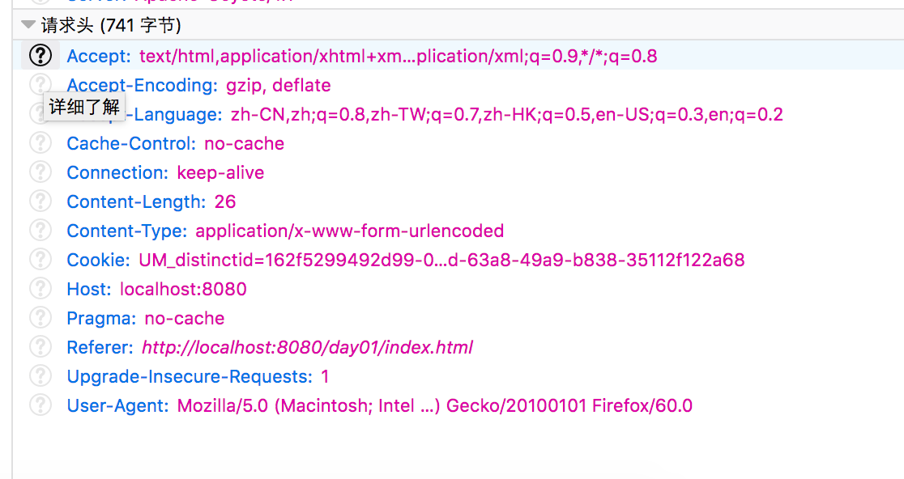
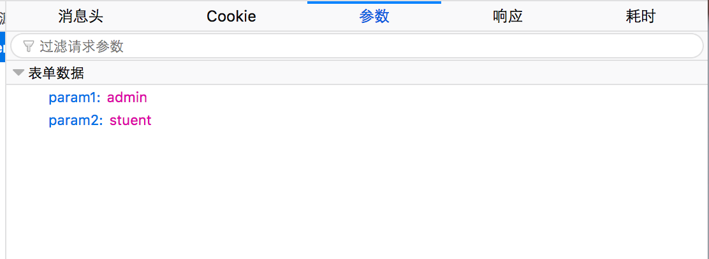

### GET 和 POST 请求的区别

- GET 中的总字符数是有限制的，这个限制取决于服务器。

- 用 GET 请求发送的数据会追加到 URL 后面，在浏览器的地址栏中会显示出来，所以你发送的数据就会完全暴露。

  例如

  

`GET` 请求的资源路径以及增加到 `URL` 的所有参数都会包含在请求行中。

### GET 请求

`GET` 请求行：

> /date2?param1=admin&param2=student

`HTTP` 协议版本

> HTTP/1.1

`GET` 请求头：

### POST 请求

`POST` 请求行：

> /date2

`POST` 请求头：

`POST` 请求体：

### HTTP响应类型

> HTTP/1.1 200 OK
>
> Set-Cookie: JSESSIONID=xxxxxxx
>
> Content-Type: text/html
>
> Content-Length: 387
>
> Date:xxx
>
> Server:xxx
>
> Connection:close

`Content-Type`（内容类型）响应首部的值称为 `MIME` 类型。`MIME` 类型告诉浏览器要接受的数据是什么类型。