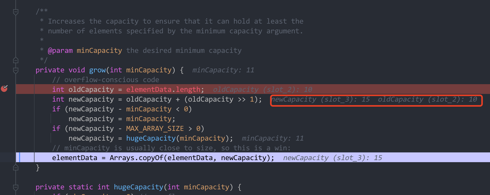

ArrayList 是我们平时工作中最长用的一个集合，遇到什么东西，不管三七二十一，先 new ArrayList 再说。那么它的底层是如何设计和实现的，今天来探讨一番。


> ArrayList 是线程不安全的，基于数组实现。查询效率比较高，


首先，我们看看最常规的几种写法

```java
// 不指定 list 初始容量
List<String> list = new ArrayList<>();

// 指定了初始容量
List<String> list1 = new ArrayList<>(10);
```

先看第一种的默认实现，点进去一窥究竟

```java
/**
  * Shared empty array instance used for default sized empty instances. We
  * distinguish this from EMPTY_ELEMENTDATA to know how much to inflate when
  * first element is added.
  * 初始化的时候，并不知道要给 list 扩容多少，因此在第一次添加元素的时候，才会对 list 进行扩容
  */
private static final Object[] DEFAULTCAPACITY_EMPTY_ELEMENTDATA = {};

/**
 * Constructs an empty list with an initial capacity of ten.
 */
public ArrayList() {
    this.elementData = DEFAULTCAPACITY_EMPTY_ELEMENTDATA;
}
```

DEFAULTCAPACITY_EMPTY_ELEMENTDATA 这个东西就是一个空的 object 对象，从描述上来说，初始的容量是 10，但是准确上来说，初始化并不是 10，如果不给定默认初始容量的话，并且不操作 add 方法的话，默认的容量就是 0

**初始化容量为 10，只是在第一次 add 的时候，会去检查数组是否有位置可以存放元素，如果没有就进行扩容。**

如果 list 只是 new 了一个 ArrayList，而没有对 list 做 add 操作，那么 list 是不会进行扩容的。


关于扩容，源码中的注释也说明了这点，下面看看 add 操作。**默认 add 操作是尾部插入元素**。

```java
/**
 * Appends the specified element to the end of this list.
 *
 * @param e element to be appended to this list
 * @return <tt>true</tt> (as specified by {@link Collection#add})
 */
public boolean add(E e) {
    ensureCapacityInternal(size + 1);  // Increments modCount!!
    elementData[size++] = e;
    return true;
}

// size 的定义
/**
  * The size of the ArrayList (the number of elements it contains).
  * 集合中的元素个数
  * @serial
  */
private int size;
```

当第一次添加的时候，size 默认是 0，那么就要考虑扩容操作了。看看 ensureCapacityInternal 方法做了什么？

```java
//第一次添加，传入的就是 size + 1 = 1
private void ensureCapacityInternal(int minCapacity) {
  	// elemenetData 是一个空的 Object 数组，第一次进入，两则相同
    if (elementData == DEFAULTCAPACITY_EMPTY_ELEMENTDATA) {
      	//获取应该扩容的最小值
      	//DEFAULT_CAPACITY 在定义上默认给定了 10
        minCapacity = Math.max(DEFAULT_CAPACITY, minCapacity);
    }

    ensureExplicitCapacity(minCapacity);
}

private void ensureExplicitCapacity(int minCapacity) {
    modCount++; // 从 0 开始计算

    // overflow-conscious code
  	//第一次进入满足条件
    if (minCapacity - elementData.length > 0)
        grow(minCapacity);
}
```

从上面的代码中我们可以看到，

- 第一次进入时，minCapacity 默认传进 1，此时 elementData 和 DEFAULTCAPACITY_EMPTY_ELEMENTDATA 相等，那么就应该从默认的容量（DEFAULT_CAPACITY）和传入的最小容量（minCapacity）中选择一个最大的值作为扩容的基数
- 执行完毕后将最大值赋值给 minCapacity，此时 minCapacity 的值已经变成了默认的 10
- 执行 ensureExplicitCapacity 方法
- ensureExplicitCapacity 方法中传入了最小的 minCapacity 和 elementData.length 相减是否大于 0，此时的 elementData默认还是一个空的数组，10 - 0 必然大于 0，满足条件，则开始扩容

```java
/**
 * Increases the capacity to ensure that it can hold at least the
 * number of elements specified by the minimum capacity argument.
 *
 * @param minCapacity the desired minimum capacity
 */
//第一次进入传入的 minCapacity 为 10
private void grow(int minCapacity) {
    // overflow-conscious code
  	// 第一次进入 elementData.length = 0
    int oldCapacity = elementData.length;  //获取到旧的容量 0
    int newCapacity = oldCapacity + (oldCapacity >> 1); // 将旧容量 + （旧容量向右移位 1) = 0
    if (newCapacity - minCapacity < 0) 0 - 10 < 0
        newCapacity = minCapacity;  // 10
    if (newCapacity - MAX_ARRAY_SIZE > 0) //新的容量要大于整数 MAX_ARRAY_SIZE 了，这个时候就可能抛出内存错误
        newCapacity = hugeCapacity(minCapacity);
    // minCapacity is usually close to size, so this is a win:
  	//这里才是对数组真正进行扩容了
  	//生成一个新的数组，把值拷贝过去
    elementData = Arrays.copyOf(elementData, newCapacity);
}

private static int hugeCapacity(int minCapacity) {
    if (minCapacity < 0) // overflow
        throw new OutOfMemoryError();
    return (minCapacity > MAX_ARRAY_SIZE) ?
        Integer.MAX_VALUE :
        MAX_ARRAY_SIZE;
}
```


注意 ensureExplicitCapacity 方法中的  if (minCapacity - elementData.length > 0) 条件，执行一次后 elementData.length 为 10 了，只有当存入第十一的元素的时候，不满足条件才会进行扩容


那么每次扩容的量是多少，我们断点调试，当存储第 10 个元素的时候，理论上来说不满足条件了，那么数据要动态扩容了，我们看下扩容的量是多少。



这里有三步

1. 把数组的 size 赋值给 oldCapacity
2. 新的容量 newCapacity = oldCapacity + oldCapacity >> 1
3. 如果新容量 - 最小容量（size+1） < 0 就把最小容量赋值给新容量（实际上这部只在初始化为 10 的时候才会去执行）
4. 如果新容量 比 Integer 最大值 - 8 还要大，那么 JVM 将无法处理。


当数组刚好存满的时候，进行扩容，扩容量 10 + 10 >> 1 = 15 新的扩容数量

由此我们可以算出第二次扩容 15 + 15 >> 1 =  15 + 7 = 22

第三次扩容就是 22 + 22 >> 1 = 22 + 11 =  33


**近似可以看做是每次扩容是 1.5 倍扩容**，只是近似，不代表真是 1.5 被扩容，例如第二次扩容


## 注意 size + 1 的情况

为什么要 size + 1，

- size  + 1 是为了保证数组刚好够存储下元素

- 还为了保证扩容不会出现错误

如果不处理的话，默认 size 为 0，则 0 + 0 >> 1 = 0；1 + 1 >> 1 = 1。


可能有人会说，默认的 size 不是 10 吗？**从 1.8 开始，如果不指定容量，默认的 size 不会在构造函数里面添加，而是会在第一次 add 元素的时候去初始化默认空间**。所以 size + 1 对扩容来说是非常重要的。


## 附录

计算机中的移位操作

```shell
>> 右移操作
<< 左移操作
```

**1.右移位解释**

将运算的二进制数整体右移指定位数，整数位用 0 补齐，负数高位用 1 补齐（保持负数符号不变）

举个例子，

- 十进制数 10，转换成 2 进制，等于 2<sup>3</sup> + 2<sup>1</sup> = 10，对应的二进制写法为  1010
- 向右移动一位，那么就意味着原来的 1010 变更成 0101，对应的值转换成十进制 2<sup>2</sup> + 2<sup>0</sup> = 4 + 1 = 5


**2.左移位**

将运算数的二进制数整体左移指定位数，低位用 0 补齐

举个例子

- 十进制数 10 ，转换成 2 进制，等于 2<sup>3</sup> + 2<sup>1</sup> = 10，对应的二进制写法为 1010
- 向左移动一位，那么就意味着原来的 1010 变成了 10100，对应的数值转换成 2<sup>4</sup> + 2<sup>2</sup> = 10

