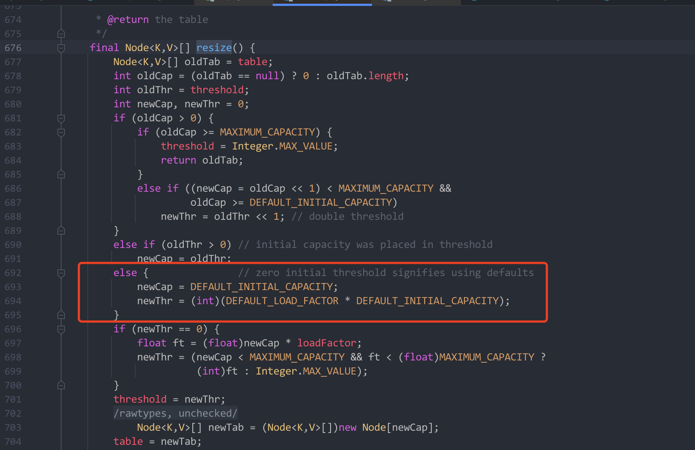
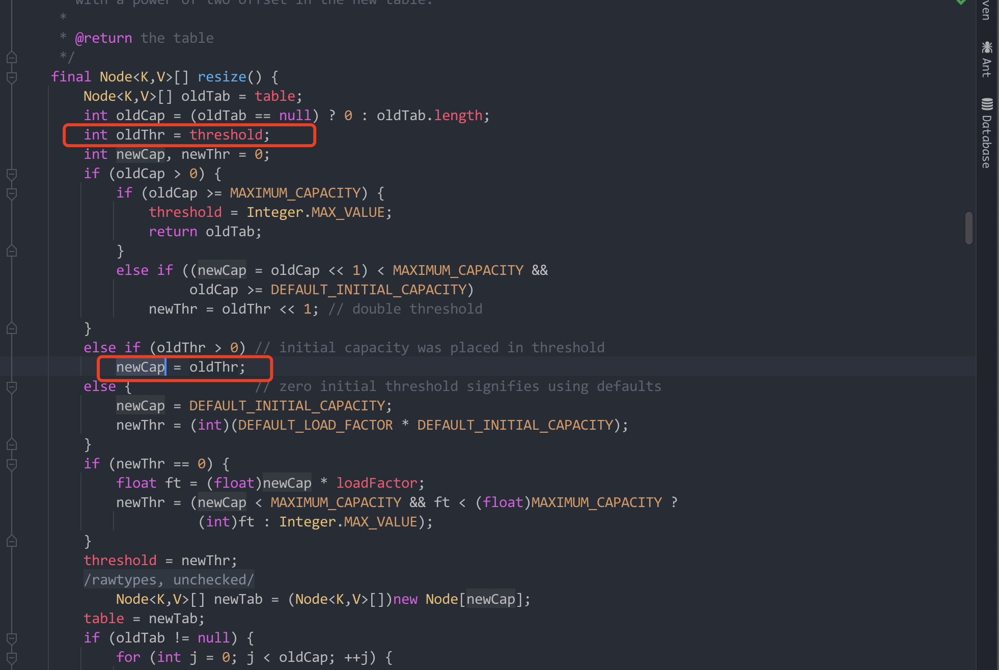

> 基于 JDK1.8 源码

- 默认容量多少，负载因子多少，扩容倍数
- 底层数据结构
- 如何处理 hash 冲突
- 如何计算一个 key 的 hash 值
- 数组长度为什么是 2 的幂次方
- 扩容查找过程


开始之前，先看一下基本的属性。

```java
/**
 * 默认的初始化容量，必须是 2 的 幂次方
 */
static final int DEFAULT_INITIAL_CAPACITY = 1 << 4; // aka 16  二进制 1 向左移四位

/**
  * 最大容量，左移三十位，也就是 2 的 30 次方
  */
static final int MAXIMUM_CAPACITY = 1 << 30;

/**
  * 默认的负载因子
  */
static final float DEFAULT_LOAD_FACTOR = 0.75f; //不指定的话，默认为 0.75f

/**
 * Node 节点数组, 用来表示一个 key-value
 * 内部类
 */
transient Node<K,V>[] table;
```


节点的数据存储使用一个内部类 Node 来存储，源码如下

```java
static class Node<K,V> implements Map.Entry<K,V> {
    final int hash; //节点 hash
    final K key; // key
    V value; // value
    Node<K,V> next; //下一个节点

    Node(int hash, K key, V value, Node<K,V> next) {
        this.hash = hash;
        this.key = key;
        this.value = value;
        this.next = next;
    }

    public final K getKey()        { return key; }
    public final V getValue()      { return value; }
    public final String toString() { return key + "=" + value; }

    public final int hashCode() {
        return Objects.hashCode(key) ^ Objects.hashCode(value);
    }

    public final V setValue(V newValue) {
        V oldValue = value;
        value = newValue;
        return oldValue;
    }

    public final boolean equals(Object o) {
        if (o == this)
            return true;
        if (o instanceof Map.Entry) {
            Map.Entry<?,?> e = (Map.Entry<?,?>)o;
            if (Objects.equals(key, e.getKey()) &&
                Objects.equals(value, e.getValue()))
                return true;
        }
        return false;
    }
}
```

由上可以看出，每一个节点都存储了下一个节点，是一种链表形式的存储。注意到它重写了 hashCode 方法和 equals 方法。


## HashMap 初始化

在 HashMap 中，我们最常用的初始化方式就是使用默认构造方法 `Map<String, Object> map = new HashMap<>();` 和使用初始容量的构造方法 `Map<String, Object> map2 = new HashMap<>(32);`，先看默认的构造方法源码

```java
/**
 * 给定了一个默认的负载因子
 */
public HashMap() {
    this.loadFactor = DEFAULT_LOAD_FACTOR;
}
```

指定了负载因子，默认的负载因子为 0.75f

再看一下指定了默认容量的构造方法

```java
/**
 * @param initialCapacity 传进来的初始化容量
 * 指定了默认的负载因子
 */
public HashMap(int initialCapacity) {
    this(initialCapacity, DEFAULT_LOAD_FACTOR);
}
```

发现它调用了自身的另一个构造方法，源码如下

```java
/**
 * 构造了一个空的 HashMap
 * @params initialCapacity 传进来的初始化容量
 * @params loadFactor 负载因子
 */
public HashMap(int initialCapacity, float loadFactor) {
    if (initialCapacity < 0)
        throw new IllegalArgumentException("Illegal initial capacity: " +
                                           initialCapacity);
    if (initialCapacity > MAXIMUM_CAPACITY)
        initialCapacity = MAXIMUM_CAPACITY; //初始容量大于最大容量，就把最大容量赋值给初始容量
    if (loadFactor <= 0 || Float.isNaN(loadFactor)) // 负载因子小于 0，或者非浮点数则抛出非法参数异常
        throw new IllegalArgumentException("Illegal load factor: " +
                                           loadFactor);
    this.loadFactor = loadFactor; //负载因子
  	// threshold 阈值
    this.threshold = tableSizeFor(initialCapacity);
}
```

threshold 是阈值。先暂且不管阈值是啥，我们注意到它调用了 tableSizeFor 这个方法，直接去看 tableSizeFor 方法的源码

```java
/**
 * Returns a power of two size for the given target capacity.
 */
static final int tableSizeFor(int cap) {
    int n = cap - 1;
    n |= n >>> 1;
    n |= n >>> 2;
    n |= n >>> 4;
    n |= n >>> 8;
    n |= n >>> 16;
    return (n < 0) ? 1 : (n >= MAXIMUM_CAPACITY) ? MAXIMUM_CAPACITY : n + 1;
}
```

这里做了位运算[^1]，该方法的作用是为了返回一个比给定容量最接近的 2<sup>n</sup> 的值。

- 给定容量 3，最接近的值就是 2<sup>2</sup> = 4
- 给定容量 6，最接近的就是 2<sup>3</sup> = 8
- 给定容量 10，最接近的就是 2<sup>4</sup> = 16

由此可以得出规律：该算法的作用是**把最高位 1 后面的数值全部变成 1，最后将计算出来的结果 + 1**。

> 例如 3 二进制 为 11，经过计算 2<sup>1</sup> + 2<sup>0</sup>  = 3 + 1
>
> 例如 7 二进制为 111，经过计算  2<sup>2</sup> + 2<sup>1</sup> + 2<sup>0</sup>   = 7 + 1
>
> 例如 13 二进制为 1101，转换后 1111，经过计算 2<sup>3</sup> + 2<sup>2</sup> + 2<sup>1</sup> + 2<sup>0</sup>  = 8 + 4 + 2 + 1 = 15 + 1 = 16 

依次类推，这里把阈值设置成与给定容量最接近的一个 2 的幂次方（包含等于），**也就是说 HashMap 的容量始终都是 2 的幂次方**。


> HashMap 的容量的初始化并不是在构造方法中初始化的，而是在 resize 中初始化的。
>
> resize 是扩容方法，那么扩容方法会在哪里被调用？很显然，put 方法中一定会被调用，每一次的 put 方法之前都会去检查容量是否足够，不够就扩容。


## put 添加元素

上面说到 HashMap 默认大小为 16，在构造方法里面我们并没有看到他有初始化容量的动作，那么它的默认容量是在哪里初始化的呢？我们看一下 put 方法，发现它最终调用的是 putVal 方法，源码如下：

```java
/**
 *
 * @param hash // key 的 hash 值
 * @param key  // key 值
 * @param value // key 对应的 value
 * @param onlyIfAbsent if true, don't change existing value // 如果设置为 true，则不会改变已经存在的值，put 方法传进来时，默认传入的是 false，如果放进来的值已经存在，它就会对值进行覆盖
 * @param evict if false, the table is in creation mode. 
 * @return previous value, or null if none
 */
final V putVal(int hash, K key, V value, boolean onlyIfAbsent, boolean evict) {
    Node<K,V>[] tab; Node<K,V> p; int n, i;
    if ((tab = table) == null || (n = tab.length) == 0)
        n = (tab = resize()).length;  //这里调用了 resize 方法
    if ((p = tab[i = (n - 1) & hash]) == null) //判断要存放的位置的值是否为 null，说明该位置没有元素，可以插入
        tab[i] = newNode(hash, key, value, null); // 向尾部插入一个节点
    else { //如果有元素
        Node<K,V> e; K k;
        if (p.hash == hash &&
            ((k = p.key) == key || (key != null && key.equals(k))))
            e = p;
        else if (p instanceof TreeNode)
            e = ((TreeNode<K,V>)p).putTreeVal(this, tab, hash, key, value);
        else {
            for (int binCount = 0; ; ++binCount) {
                if ((e = p.next) == null) {
                    p.next = newNode(hash, key, value, null);
                    if (binCount >= TREEIFY_THRESHOLD - 1) // -1 for 1st
                        treeifyBin(tab, hash);
                    break;
                }
                if (e.hash == hash &&
                    ((k = e.key) == key || (key != null && key.equals(k))))
                    break;
                p = e;
            }
        }
        if (e != null) { // existing mapping for key
            V oldValue = e.value;
            if (!onlyIfAbsent || oldValue == null)
                e.value = value;
            afterNodeAccess(e);
            return oldValue;
        }
    }
    ++modCount;
    if (++size > threshold)
        resize();
    afterNodeInsertion(evict);
    return null;
}
```

在 putVal 方法的第四行中，注意到它调用了 resize 方法，同时在方法的倒数第三行，同样也调用了 resize 方法。显然，第一个 resize 方法在第一次初始化 HashMap 的容量时会被调用，而第二个 resize 方法会在 HashMap 超过阈值后调用。

先看看 resize（扩容） 的源码

```java
final Node<K,V>[] resize() {
    Node<K,V>[] oldTab = table;
    int oldCap = (oldTab == null) ? 0 : oldTab.length; //获取到旧的容量
    int oldThr = threshold;  //旧的阈值
    int newCap, newThr = 0;  //新容量，新阈值均设置成 0
    if (oldCap > 0) { //旧容量大于 0 时
     		//旧容量超过了最大容量，就设置 Integer.MAX_VALUE 为阈值
        if (oldCap >= MAXIMUM_CAPACITY) {
            threshold = Integer.MAX_VALUE;
            return oldTab;
        } else if ((newCap = oldCap << 1) < MAXIMUM_CAPACITY &&
                 oldCap >= DEFAULT_INITIAL_CAPACITY)
          	//将旧容量 * 2 赋值给新容量
            newThr = oldThr << 1; // 双倍扩容
    } else if (oldThr > 0)  //旧阈值大于 0
        newCap = oldThr;
    else { //旧容量不大于0，旧阈值也不大于 0 ==> 初始化会走此分支              
        newCap = DEFAULT_INITIAL_CAPACITY; //初始化容量赋值为新容量
        newThr = (int)(DEFAULT_LOAD_FACTOR * DEFAULT_INITIAL_CAPACITY); // 初始化负载因子 * 默认容量为新阈值
    }
    if (newThr == 0) {
        float ft = (float)newCap * loadFactor;
        newThr = (newCap < MAXIMUM_CAPACITY && ft < (float)MAXIMUM_CAPACITY ?
                  (int)ft : Integer.MAX_VALUE);
    }
    threshold = newThr; //把新的阈值设置回去
    @SuppressWarnings({"rawtypes","unchecked"})
  	//扩容时 newTable 初始化
    Node<K,V>[] newTab = (Node<K,V>[])new Node[newCap];
    table = newTab;
  
  	//扩容后，对值进行转移
    if (oldTab != null) { //扩容后，将 oldTab 中的值转移到 newTab 中去
        for (int j = 0; j < oldCap; ++j) { //遍历旧的 oldTab
            Node<K,V> e;
            if ((e = oldTab[j]) != null) {
                oldTab[j] = null; //旧 oldTab[j] 设置成 null，回收内存
                if (e.next == null) //没有下一个节点，只有一个节点
                    newTab[e.hash & (newCap - 1)] = e;
                else if (e instanceof TreeNode) //如果是树形结构
                    ((TreeNode<K,V>)e).split(this, newTab, j, oldCap);
                else { // 不止一个节点，并且不是树形结构
                    Node<K,V> loHead = null, loTail = null;
                    Node<K,V> hiHead = null, hiTail = null;
                    Node<K,V> next;
                    do {
                        next = e.next;
                        if ((e.hash & oldCap) == 0) {
                            if (loTail == null)
                                loHead = e;
                            else
                                loTail.next = e;
                            loTail = e;
                        }
                        else {
                            if (hiTail == null)
                                hiHead = e;
                            else
                                hiTail.next = e;
                            hiTail = e;
                        }
                    } while ((e = next) != null);
                    if (loTail != null) {
                        loTail.next = null;
                        newTab[j] = loHead;
                    }
                    if (hiTail != null) {
                        hiTail.next = null;
                        newTab[j + oldCap] = hiHead;
                    }
                }
            }
        }
    }
    return newTab;
}
```

这个 put 方法要分几种场景来看

**1. 直接使用 new HashMap<>() 后调用 put 方法**

此时旧阈值为 0，旧容量也为 0，调用 resize 方法进行初始化。此时调用 resize 方法，会默认将 16 空间的初始化容量赋值 newCap，将默认 16 空间值 * 0.75f = 12 赋值值（newThr）新阈值。



**2.直接使用 new HashMap<>() 后调用 put 方法**

根据传入的容量获取阈值，也就是最接近的一个 2 的幂次方。负载因子依然是 0.75



那么这里就可以得出结论了，HashMap 的容量始终都为 2 的幂次方。


接着 putVal 方法往下看，发现 `Node<K, V>[] newTab = (Node<K, V>[]) new Node[newCap]`，那就可以知道了，HashMap 是在这个地方做的初始化，初始化了一个容量为 2 的幂次方的节点数组。

这里还隐含了一个信息，HashMap 每次扩容都会生成一个新的节点数组。如果不是在第一次调用，那么后续扩容的时候，每次都是以旧容量的两倍扩容。


元素转移的过程


**Map 里面存放对象的话，需要重写 hashCode 方法和 equals 方法**


[^1]: 位运算