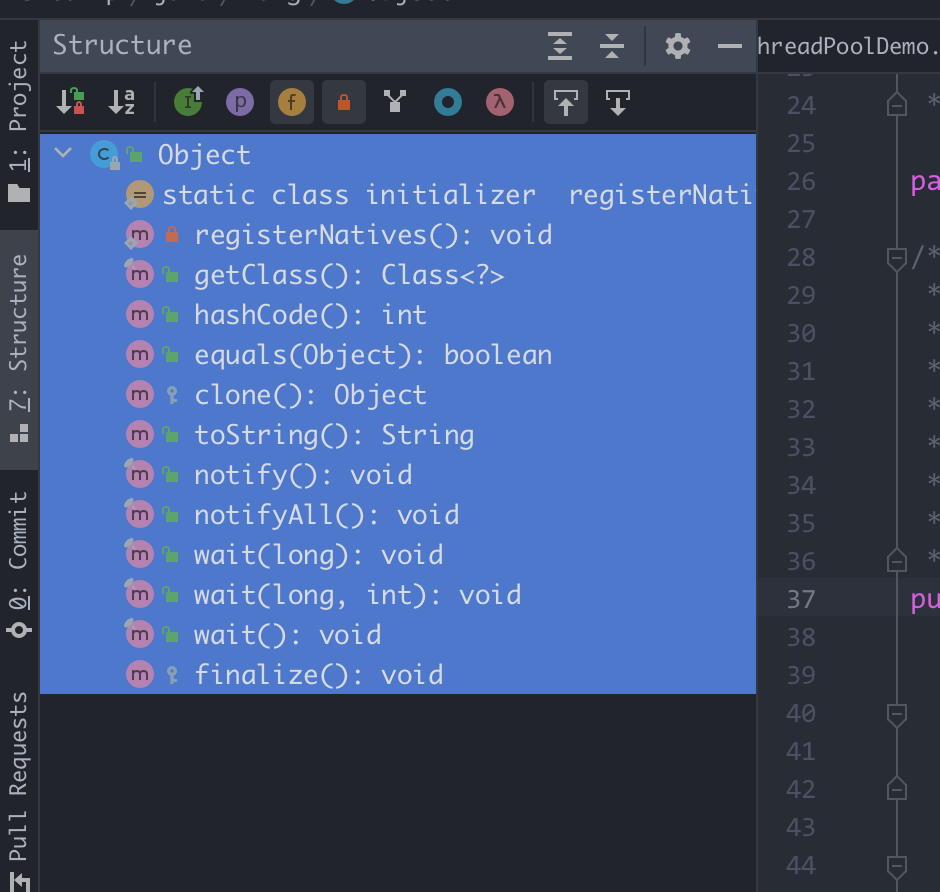

> 基于 JDK1.8

Object 是 java 中所有类的父类，一切不管是自定义的类还是 java 本身的类库中的类都是继承自 Object。该类是在 java.lang 包下。

以下是 jdk 文档中对于 Object 类的解释：

```java
// Class Object is the root of the class hierarchy. Every class has Object 
// as a superclass. All objects, including arrays, implement the methods
// of this class.
public class Object
```

```yaml
Object
	- registerNatives()
	- getClass()
	- hashCode()
	-	equals()
	-	clone()
	-	toString()
	- notify()
	- notifyAll()
	-	wait()
 	- wait(long)
	- wait(long, int)
	-	finalize()
```



上述共 12 个方法，加上构造方法，总共 13 个。


## 具体解释

Object 中的一些方法如下

**1. Object()**

默认构造方法

```java
//默认的构造方法，用于创建对象
Object() 
```

**2.registerNatives()**

注册本地方法，调用 c

```java
private static native void registerNatives();
static {
    registerNatives();
}
```

**3.clone()**

克隆出当前对象的一个拷贝，**前提是该类必须实现 Cloneable 接口**，如果未实现该接口并且调用了该方法，会抛出 `CloneNotSupportedException` 异常

```java
// Creates and returns a copy of this object.
// 创建并返回该对象的一个拷贝。
protected Object clone() throws CloneNotSupportedException
```

**4.equals()**

```java
//Indicates whether some other object is "equal to" this one.
//比较两个对象的引用是否相等
boolean equals(Object obj)
```

**5.finalize()**

当垃圾回收器确定不存在对该对象的引用时，由垃圾回收器调用此方法。

```java
// Called by the garbage collector on an object when garbage collection
// determines that there are no more references to the object.
// 被垃圾回收器调用，当垃圾回收器觉得一个对象没有其他引用时
protected void finalize() throws Throwable { }
```

**6.getClass()**
用于获得运行时的类型。该方法返回的是此 Object 对象的类对象/运行时类对象 Class，效果与 Object.class 相同。**该方法是 final 类型的。**

```java
//Returns the runtime class of this {@code Object}.
public final native Class<?> getClass();
```

**7.hashCode()**

该方法用来返回其所在对象的物理地址（哈希码值），常会和equals方法同时重写，确保相等的两个对象拥有相等的hashCode。

```java
//a hash code value for this object.	
public int hashCode()
```

**8.notify()**

唤醒在此对象监视器上等待的单个线程

```java
// Wakes up a single thread that is waiting on this object's monitor.
public final native void notify();
```

**9.notifyAll()**

唤醒在此对象监视器上等待的所有线程

```java
// Wakes up all threads that are waiting on this object's monitor
public final native void notifyAll();
```

**10.wait()**

导致当前的线程等待，直到其他线程调用此对象的 notify() 方法或 notifyAll() 方法

```java
// Causes the current thread to wait until another thread invokes the
// {@link java.lang.Object#notify()} method or the
// {@link java.lang.Object#notifyAll()} method for this object.
public final void wait() throws InterruptedException {
    wait(0);
}
```

**11.wait(long)**

导致当前的线程等待，直到其他线程调用此对象的 notify() 方法或 notifyAll() 方法，或者超过指定的时间量

```java
// Causes the current thread to wait until either another thread invokes the
// {@link java.lang.Object#notify()} method or the
// {@link java.lang.Object#notifyAll()} method for this object, or a
// specified amount of time has elapsed.
public final native void wait(long timeout) throws InterruptedException;
```

**12.wait(long, int)**

导致当前的线程等待，直到其他线程调用此对象的 notify() 方法或 notifyAll() 方法，或者其他某个线程中断当前线程，或者已超过某个实际时间量。

```java
/** Causes the current thread to wait until another thread invokes the
  * {@link java.lang.Object#notify()} method or the
  * {@link java.lang.Object#notifyAll()} method for this object, or
  * some other thread interrupts the current thread, or a certain
  * amount of real time has elapsed.
  */
public final void wait(long timeout, int nanos) throws InterruptedException {
    if (timeout < 0) {
        throw new IllegalArgumentException("timeout value is negative");
    }

    if (nanos < 0 || nanos > 999999) {
        throw new IllegalArgumentException(
                            "nanosecond timeout value out of range");
    }

    if (nanos > 0) {
        timeout++;
    }

    wait(timeout);
}
```

**13.toString()**

返回该对象的名称 + hashcode

```java
// Returns a string representation of the object.
public String toString() {
  return getClass().getName() + "@" + Integer.toHexString(hashCode());
}
```