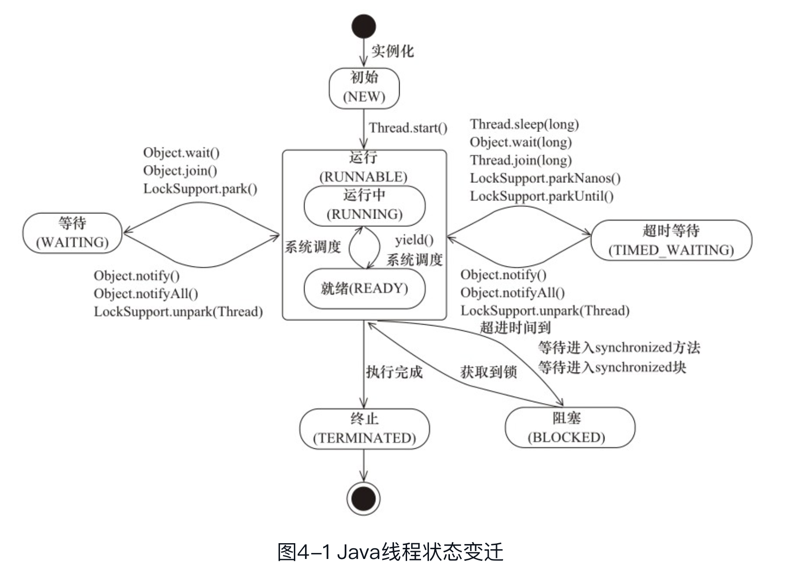

线程是操作系统的调度的基本单元，一个程序作为一个进程来执行，程序运行的过程中能够创建多个线程，而一个线程在一个时刻只能运行在一个处理器核心上。

## Main 方法启动会创建几个线程

> 基于 JDK1.8

main 方法在启动的过程中会创建多个线程，可以使用以下代码来测试一下。

```java
public static void main(String[] args){
    ThreadMXBean threadMXBean = ManagementFactory.getThreadMXBean();
    ThreadInfo[] threadInfos = threadMXBean.dumpAllThreads(false, false);
    for (ThreadInfo threadInfo: threadInfos){
        System.out.println("[" + threadInfo.getThreadId() + "] " + threadInfo.getThreadName());
    }
}
```

观察到它的打印

```shell
[5] Monitor Ctrl-Break
[4] Signal Dispatcher  //分发处理发送给 JVM 的线程
[3] Finalizer  //调用对象的 finalize 方法的线程
[2] Reference Handler //清除 Reference 的线程
[1] main  //用户 main 线程
```

> 一个 Java 程序的运行不仅仅只是 main() 方法的运行，而是 main 线程和多个其他的线程同时运行。


## 线程优先级

操作系统会分出一个个时间片，线程会分配到若干的时间片，当某一个线程的时间片使用完了就会发现线程调度，并等待下一次分配。线程分配的时间片是多少也就决定了线程占用的处理器资源的多少，而**线程优先级**是决定线程需要多或者少分配一些处理器资源的属性。

```java
 /**
  * The minimum priority that a thread can have.
  */
 public final static int MIN_PRIORITY = 1;

/**
  * The default priority that is assigned to a thread.
  */
 public final static int NORM_PRIORITY = 5;

 /**
  * The maximum priority that a thread can have.
  */
 public final static int MAX_PRIORITY = 10;
```

看到线程 Thread 类中定义了三个常量，**最小优先级为 1，最大优先级为 10。说明了优先级只有 1~10 个等级。而线程的默认优先级通常为 5**

> 程序执行的准确行并不依赖线程的优先级。可能你设置了优先级，但是程序并不会按照你设置的优先级去执行。


## 线程的运行状态

| 状态名称     | 说明                                                         |
| ------------ | ------------------------------------------------------------ |
| NEW          | 初始状态，线程被构建，但是还没有调用 start 方法              |
| RUNABLE      | 运行状态，Java 线程将操作系统中就绪和运行两种状态笼统称为 ”运行中“ |
| BLOCKED      | 阻塞状态，表示线程正在阻塞中                                 |
| WAITING      | 等待状态，表示线程进入等待状态，进入该状态表示当前线程需要等待其他线程做出一些指令（通知或者中断） |
| TIME_WAITING | 超时等待，该状态不同于 WAITING，它是可以在指定的时间内返回的。 |
| TERMINAED    | 终止状态，表示当前线程已经执行完毕                           |


```shell
"BlockedThread2" #16 prio=5 os_prio=31 tid=0x00007ff0de821000 nid=0xa603 waiting for monitor entry [0x000070000eb90000]
   java.lang.Thread.State: BLOCKED (on object monitor) # BlockedThread1 已经获取到锁，导致 ThreadBlock2 被阻塞
	at me.lqw.interview.thread.ThreadState$Blocked.run(ThreadState.java:52)
	- waiting to lock <0x000000076ae3dcc0> (a java.lang.Class for me.lqw.interview.thread.ThreadState$Blocked)
	at java.lang.Thread.run(Thread.java:745)

"BlockedThread1" #15 prio=5 os_prio=31 tid=0x00007ffbf1875000 nid=0xa403 waiting on condition [0x000070000568e000]
   java.lang.Thread.State: TIMED_WAITING (sleeping)  ## 超时等待状态
	at java.lang.Thread.sleep(Native Method)
	at java.lang.Thread.sleep(Thread.java:340)
	at java.util.concurrent.TimeUnit.sleep(TimeUnit.java:386)
	at me.lqw.interview.thread.SleepUtils.second(SleepUtils.java:9)
	at me.lqw.interview.thread.ThreadState$Blocked.run(ThreadState.java:49)
	- locked <0x000000076ae3dc30> (a java.lang.Class for me.lqw.interview.thread.ThreadState$Blocked)
	at java.lang.Thread.run(Thread.java:745)

"WaitingThread" #14 prio=5 os_prio=31 tid=0x00007ffbf1874000 nid=0xa603 in Object.wait() [0x000070000558b000]
   java.lang.Thread.State: WAITING (on object monitor) # 等待状态
	at java.lang.Object.wait(Native Method)
	- waiting on <0x000000076ae39b70> (a java.lang.Class for me.lqw.interview.thread.ThreadState$Waiting)
	at java.lang.Object.wait(Object.java:502)
	at me.lqw.interview.thread.ThreadState$Waiting.run(ThreadState.java:33)
	- locked <0x000000076ae39b70> (a java.lang.Class for me.lqw.interview.thread.ThreadState$Waiting)
	at java.lang.Thread.run(Thread.java:745)

"TimeWaitingThread" #13 prio=5 os_prio=31 tid=0x00007ffbf001b000 nid=0x5803 waiting on condition [0x0000700005488000]
   java.lang.Thread.State: TIMED_WAITING (sleeping) ## 超时等待状态
	at java.lang.Thread.sleep(Native Method)
	at java.lang.Thread.sleep(Thread.java:340)
	at java.util.concurrent.TimeUnit.sleep(TimeUnit.java:386)
	at me.lqw.interview.thread.SleepUtils.second(SleepUtils.java:9)
	at me.lqw.interview.thread.ThreadState$TimeWaiting.run(ThreadState.java:20)
	at java.lang.Thread.run(Thread.java:745)

```




## 守护线程（Daemon 线程）

Daemon 进程是一种支持型线程，当程序中没有一个非 Daemon 线程时，Java 虚拟机将会直接退出。将线程设置成守护线程是调用 Thread 类的 setDaemon 方法。

```java
/* Whether or not the thread is a daemon thread. */
private boolean     daemon = false;
```

**当 Java 线程为守护线程，且守护线程执行的代码块中存在 finally 语句时，finally 里面的语句不一定会执行。**


## 启动线程和终止线程

调用 start 启动一个线程，当 run 方法执行完毕后，线程也会随之终止。

启动一个线程时，最好为这个线程起一个名称，方便使用 jstack 工具来分析线程执行状态。


## 线程等待/通知

等待和通知相关方法

| 方法名称        | 描述                                                         |
| --------------- | ------------------------------------------------------------ |
| notify()        | 通知在一个对象上等待的线程，使其从 wait 方法返回，返回的前提是该线程必须获取到该对象的锁 |
| notifyAll()     | 通知所有在该对象上等待的线程                                 |
| wait()          | 调用该方法的线程进入 WAITING 状态，只有等待另外的线程的通知或者中断才会返回。调用 wait 方法后，会释放对象的锁 |
| wait(long)      | 超时等待一段时间，没有通知就返回。这里的单位是 毫秒          |
| wait(long, int) | 超时等待一段时间，int 是时间单位                             |

线程 A 调用了对象 O 的 wait 方法，进入等待状态，线程 B 调用了对象 O 的 notify 方法或者 notifyAll 方法。线程 A 收到通知后从对象 O 的 wait 方法返回，进而执行后续操作。

- 线程交叉打印

  ```java
  public class WaitOrNotifyTest {
      static final Object object = new Object();
      static int a = 0;
  
      public static void main(String[] args){
  
          new Thread(new WaitThread()).start();
          new Thread(new NotifyThread()).start();
      }
  
      static class WaitThread implements Runnable {
          @Override
          public void run() {
              synchronized (object){
                  for(int i = a; i < 10; i++){
                      if(i%2 == 0 ){
                          System.out.println("WaitThread print >>>>> " + i);
                          a++;
                          try {
                              object.wait();
                              object.notify();
                          } catch (InterruptedException e) {
                              e.printStackTrace();
                          }
                      }
                  }
              }
          }
      }
  
      static class NotifyThread implements Runnable {
          @Override
          public void run() {
              synchronized (object){
                  for(int i = a; i < 10; i++){
                      if(i%2 == 1){
                          System.out.println("NotifyThread print >>>>> " + i);
                          a++;
                          object.notify();
                          try {
                              object.wait();
                          } catch (InterruptedException e) {
                              e.printStackTrace();
                          }
                      }
                  }
              }
          }
      }
  }
  
  //输出结果
  WaitThread print >>>>> 0
  NotifyThread print >>>>> 1
  WaitThread print >>>>> 2
  NotifyThread print >>>>> 3
  WaitThread print >>>>> 4
  NotifyThread print >>>>> 5
  WaitThread print >>>>> 6
  NotifyThread print >>>>> 7
  WaitThread print >>>>> 8
  NotifyThread print >>>>> 9
  ```


使用 notify 和 wait 方法需要注意一下条件

- 使用 wait，notify 和 notifyAll 需要先对调用对象加锁
- 调用 wait 方法后，线程状态由 Running 变成 Waiting，并将当前线程放置到对象的等待队列
- notify 和 notifyAll 调用后，等待线程不会立即中 wait 方法返回，需要等调用 notify 或者 notifyAll 的线程释放锁之后，等待的线程才有机会从 wait 方法返回
- notify() 方法将等待队列中的一个等待线程从等待队列中移到同步队列中，而 notifyAll() 方法则是将等待队列中所有的线程全部移到同步队列，被移动的线程状态由 WAITING 变为 BLOCKED
- 从 wait() 方法返回的前提是获得了调用对象的锁

