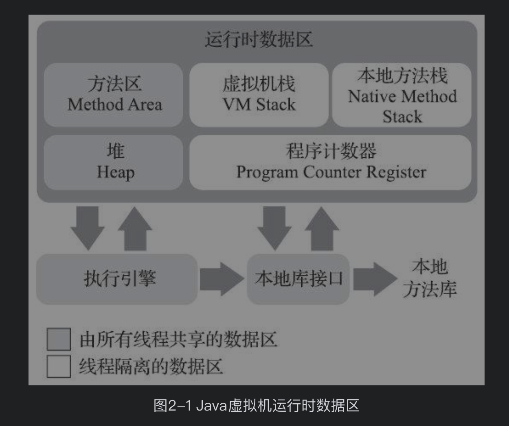

Java 虚拟机在执行 java 程序的过程中会把它所管理的内存区域划分为若干个不同的数据区域。这些区域有各自的用途，以及创建和销毁的时间。有的区域会随着虚拟机进程的启动而一直存在，有些区域则是依赖用户线程的启动和结束而建立和销毁。

## 运行时数据区域



**1.程序计数器：** 是一块较小的内存空间，它可以看做当前线程所执行的字节码指示器。它是控制程序流的指示器，分支、循环、跳转、异常处理、线程恢复等基础功能都需要依赖这个计数器来完成。**每个线程都需要一个独立的程序计数器，各条线程之间计数器不相互影响，独立存储，称这类内存区域为线程的私有内存。此内存区域是唯一一个没有规定任何 OutOfMemoryError 的区域。**

**2.Java 虚拟机栈：**也是线程私有的，它的生命周期和线程相同。虚拟机栈描述的是 java 方法执行的内存模型：每个方法被执行的时候，Java 虚拟机都会同步创建一个栈帧（Stack Frame）用于存储局部变量表、操作数栈、动态连接、Java 方法出口等信息。每一个方法被调用直至完毕的过程，就对应着一个栈帧在虚拟机中从入栈到出栈的过程。

模拟栈溢出的过程

```java
public static int stackFrameOutOf(int i){
    i++;
    System.out.println("执行 i++" + i);
    return stackFrameOutOf(i);
}
//输出
// Exception in thread "main" java.lang.StackOverflowError
//	at sun.nio.cs.UTF_8$Encoder.encodeLoop(UTF_8.java:691)
//	at java.nio.charset.CharsetEncoder.encode(CharsetEncoder.java:579)
//	at sun.nio.cs.StreamEncoder.implWrite(StreamEncoder.java:271)
//	at sun.nio.cs.StreamEncoder.write(StreamEncoder.java:125)
//	at java.io.OutputStreamWriter.write(OutputStreamWriter.java:207)
//	at java.io.BufferedWriter.flushBuffer(BufferedWriter.java:129)
//	at java.io.PrintStream.newLine(PrintStream.java:545)
//	at java.io.PrintStream.println(PrintStream.java:807)
//	at com.lqw.shell.TestStackDemo.stackFrameOutOf(TestStackDemo.java:31)
```

当出现了**方法调用**无限递归的情况时，当前线程就会抛出 `StackOverflowError` 异常。

对这块内存区域的操作会出现两种情况的异常：

- **如果线程请求的栈深度大于虚拟机所允许的深度，将抛出 `StackOverflowError` 异常。（也就是上面的异常）**
- **如果 Java 虚拟机栈的容量可以动态扩展，当栈扩展到无法申请到足够的内存时，就会抛出 `OutOfMemoryError` 异常。**

**3.本地方法栈：**本地方法栈（Native Method Stacks）与虚拟机栈所发挥的作用是非常相似的。其区别只是虚拟机栈为虚拟机执行 Java 方法，而本地方法栈为虚拟机执行本地方法。

**4.Java 堆：** Java 堆（Java Heap）是虚拟机锁管理的最大一块内存。是被所有线程共享的区域，在启动时创建。此内存区域唯一的作用是存放对象的实例，Java 世界里 "几乎" 所有的对象实例都在这里分配内存。在 《Java 虚拟机规范》中对 Java 堆的描述是："所有的对象实例以及数组都应当在堆上分配内存。"


Java 堆是垃圾收集器管理的内存区域。从回收的角度上来看，由于现代垃圾收集器大部分都是基于分带收集理论设计的，所以 Java 堆中经常会出现 "新生代"，"老年代"，"永久代"，"Eden 空间"，"From Survivor 空间"，"To Survivor 空间" 等名词。**Java 堆即可是被实现成固定大小的，也可以是被扩展的（通过参数 -Xmx 和 -Xms 设置）。如果在 Java 堆中没有内存完成实例分配，并且堆也无法再扩展时，Java 虚拟机将会抛出 `OutOfMemoryError` 异常**

**5.方法区：** 和 Java 堆一样，也是被所有线程共享的内存区域，它用于存储已被 Java 虚拟机加载的类型信息、常量、静态变量、即时编译器编译后的代码缓存数据。**通常方法区也被人称之为非堆（Non-heap）或者永久代（通过 -XX:MaxPermSize 设置）。** 如果方法区无法满足新的内存分配需求时，将抛出 `OutOfMemoryError` 异常。

运行时常量池也是方法区的一部分。Class 文件中除了有类的版本、字段、方法、接口等描述信息外，还有一项为常量池表（Constant Pool Table），用于存放编译生成的各种字面量与符号的引用，这部分的内容将在类加载后存放到方法区的运行时常量池中。运行时常量池是方法区的一部分，那么它也会受到方法区的内存限制，当常量池无法再申请到内存时会抛出 `OutOfMemoryError` 异常。


| 名称          | 解释                                                         |
| ------------- | ------------------------------------------------------------ |
| 程序计数器    | **线程私有区域**。每个线程都需要一个独立的程序计数器，各条线程之间计数器不相互影响，独立存储。 |
| Java 虚拟机栈 | **线程私有区域**。每个方法被执行的时候，Java 虚拟机都会同步创建一个栈帧（Stack Frame）用于存储局部变量表、操作数栈、动态连接、Java 方法出口等信息（可能 会抛出 `OutOfMemoryError` 异常或者 `StackOverflowError` 异常） |
| 本地方法栈    | **线程私有区域**。功能和 Java 虚拟机栈类似（VM Stacks）      |
| **Java 堆**   | **线程共享区域**。是被虚拟机管理的最大的一块内存。在启动时创建，几乎所有的实例都在这里被分配内存。通常是可扩展的，**通过参数 -Xmx 和 -Xms 设置**。如果没有内存能完成实例分配，将抛出 `OutOfMemoryError` 异常。 |
| 方法区        | **线程共享区域**。用于存储已被 Java 虚拟机加载的类型信息、常量、静态变量等等。通常也被称之为**永久代**。通过 **`-XX:MaxPermSize`** 可设置。除此之外，还存在运行时常量池。方法区无法满足新的内存分配需求时，将抛出 `OutOfMemoryError` 异常。同样常量池也会出现 `OutOfMemoryError` 异常。 |

- 堆中的内存溢出

如果是内存溢出，我们只要不断地创建对象，并且保证 GC Roots 到对象之间有可达路径来避免垃圾回收机制清除这些对象，那么随着对象数量的增加，总容量触及最大堆的容量限制后就会产生内存溢出异常。

```java
//设置参数
//-Xms20M -Xmx20M
public static void outMemoryError(){
   //创建对象都存储在堆中
   List<Object> objects = new ArrayList<>();
   while (true){
     objects.add(new Object());
   }
 }

//输出
Exception in thread "main" java.lang.OutOfMemoryError: Java heap space
	at java.util.Arrays.copyOf(Arrays.java:3210)
	at java.util.Arrays.copyOf(Arrays.java:3181)
	at java.util.ArrayList.grow(ArrayList.java:261)
	at java.util.ArrayList.ensureExplicitCapacity(ArrayList.java:235)
	at java.util.ArrayList.ensureCapacityInternal(ArrayList.java:227)
	at java.util.ArrayList.add(ArrayList.java:458)
	at com.lqw.shell.TestStackDemo.outMemoryError(TestStackDemo.java:44)
	at com.lqw.shell.TestStackDemo.main(TestStackDemo.java:29)
```


## 对象的创建过程

当 Java 虚拟机遇到一个 new 的指令时，首先会去检查这个指令的参数是否能在常量池中定位到一个类的引用，并且检查这个符号引用代表的类是否已被加载、解析和初始化过。如果没有则去执行类的加载过程。


类的加载对象通过后，将会在 Java 堆中为这个对象分配内存。对象所需要的内存在该类被加载完毕后就可确定。为对象分配空间的任务实际上变等同于把一块确定大小的内存块从 Java 堆中划分出来。


## Java 虚拟机启动参数

| 选项                             | 释义                                               |
| -------------------------------- | -------------------------------------------------- |
| -XX:+/-UseTLAB                   | 本地线程分配缓冲（Thread Local Allocation Buffer） |
| -XX:FieldsAllocationStyle        | 虚拟机分配策略参数                                 |
| **-Xms20M**                      | **堆的最小值**为 20M                               |
| **-Xmx20M**                      | **堆的最大值**为 20M                               |
| -XX:+HeapDumpOnOutOf-MemoryError | 内存溢出时自动 dump 出内存堆转储快照               |
|                                  |                                                    |
|                                  |                                                    |
|                                  |                                                    |
|                                  |                                                    |

> 将堆的最小值 `-Xms` 和堆的最大值 `-Xmx` 设置成一样，即可避免堆的自动扩展。