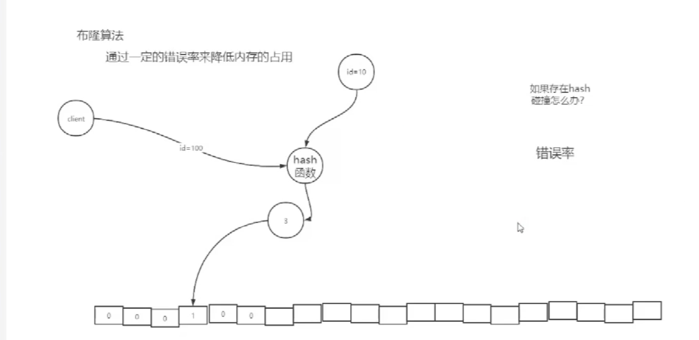

通过一定的错误率来降低内存的占用

布隆算法错误率

- 如果它告诉你数据存在，数据可能不存在
- 如果它告诉你数据不存在，那么一定不存在

降低布隆过滤器的错误率

- 数组长度
- 增加 hash 函数

缓存雪崩

Redis 中大量热门的数据，突然在某一个时刻，集中时效

1、 redis 中的数据，有效期都是一样的，给每条数据设置一个随机的有效期  给缓冲时间

2、Redis 数据库挂掉了  》 分布式缓存

- 副本集群   -》 每台机器存储一致的数据
- 切片集群 -》每台机器存储部分的数据

缓存击穿

Redis 只存储了一条数据，某一时刻缓存失效。实质都是缓存穿透，只不过是他们缓存穿透的表现形式。

- 分布式锁解决

Zookeeper 分布式锁，它是一个**分布式一致性**服务。

- 存储数据，以文件形式来存储
- 创建多种类型的目录
  - 持久目录
  - 临时目录
  - 持久有顺序目录
  - 临时有顺序目录
- 事件回调服务

