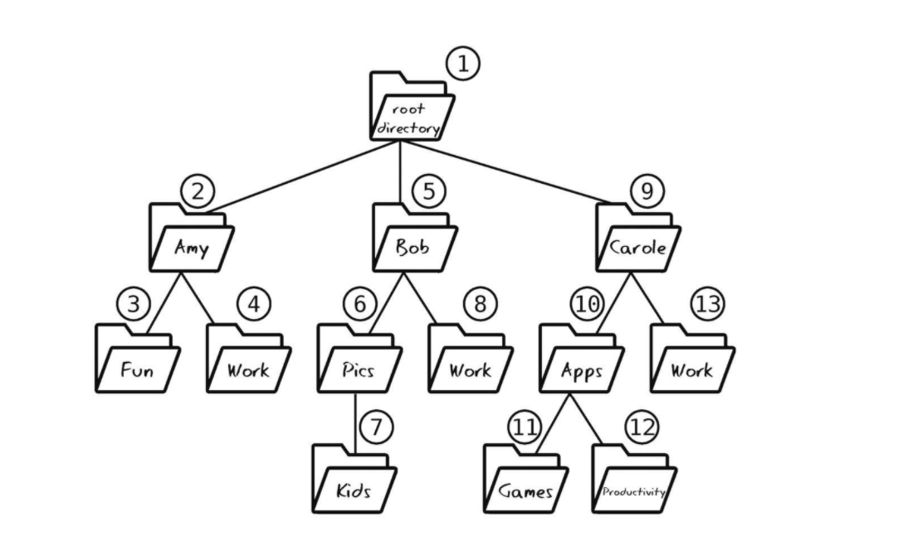

## 栈

栈的存储结构和数组一样，都是将元素排成一行。只是有一些约束：

- 只能在末尾插入元素
- 只能读取末尾的元素
- 只能移除末尾的元素

满足后进先出原则（FILO）或者（LIFO）。解释起来就是**最后入栈的元素会最先出栈**。


## 队列

队列对于临时数据的处理也有一些自己的特性，它和栈一样，都是有约束条件的数组。可以将队列想象成电影院排队，排在最前面的人会最先离队进入电影院。套用到队列中就是首先加入队列的将会首先从队列中移出。

满足先进先出原则（FIFO），它与栈类似，同样有三个限制

- 它只能在栈的末尾插入数据（跟栈一样）
- 只能取开头的数据（跟栈相反）
- 只能移除开头的数据（跟栈相反）


## 递归

例如定义如下的函数

```java
public static void run2(){
	run2();
}
```

运行这个方法，将会调用自身，这种会无限递归下去。**函数调用自身，就叫做递归**。


计算机调用 factorial(3)，并在该方法返回前，调用了 factorial(2)，而在 factorial(2) 返回前，又调用了 factorial(1)。从技术上来说，当计算机执行 factorial(1) 时，它其实还在 factorial(2) 之中，而 factorial(2) 又正在 factorial(3) 之中。计算机是用栈来记录每个调用中的函数。这个栈就叫作**调用栈**。

有趣的是，无限递归的程序会一直将同一方法加到调用栈上，直到计算机的内存空间不足，最终导致**栈溢出**的错误。



遍历目录，也可以用递归来做。

