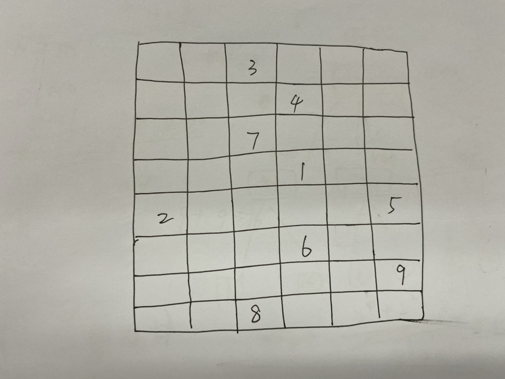
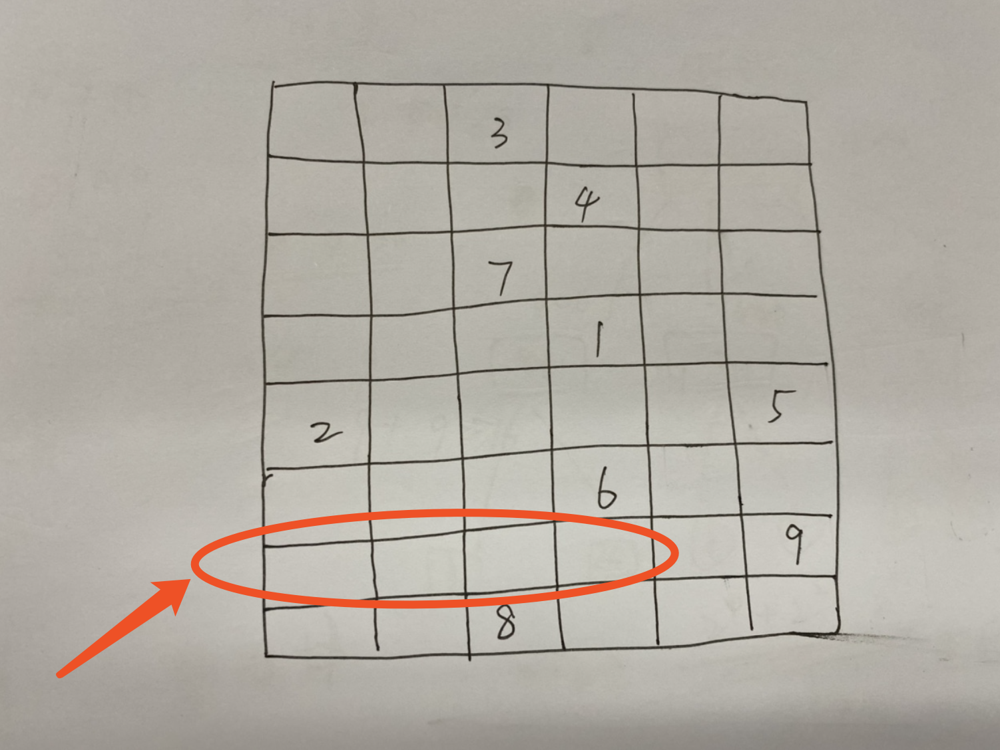
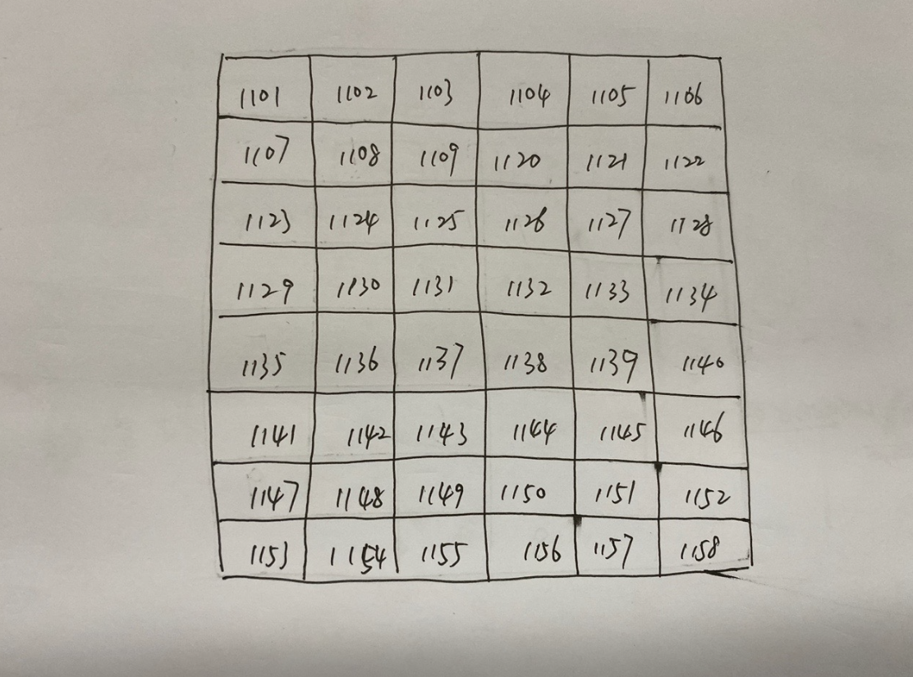
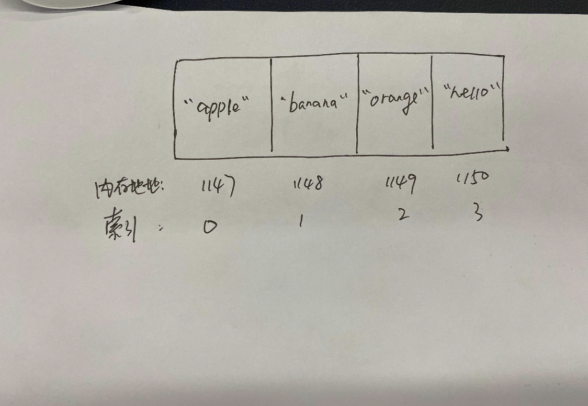
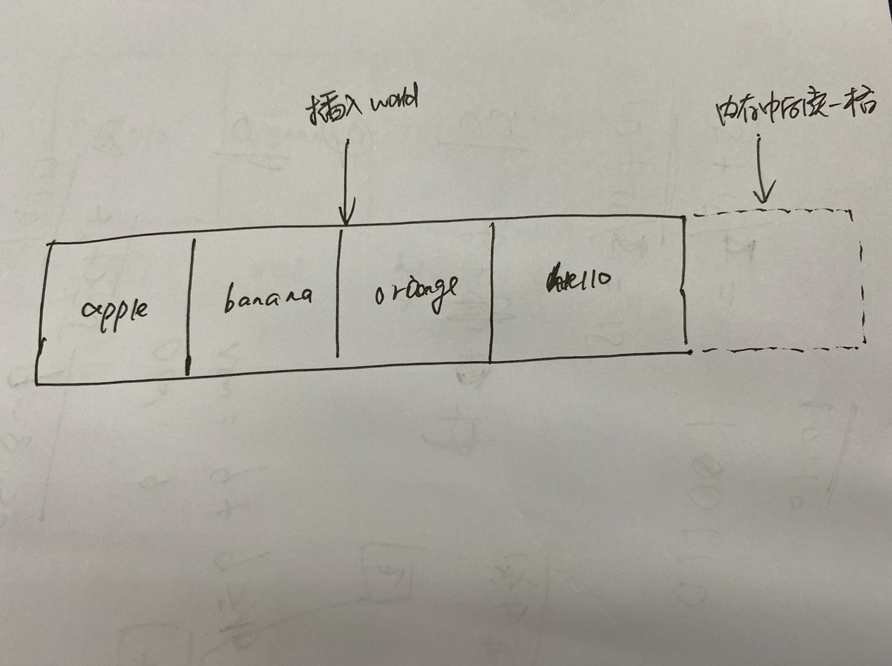
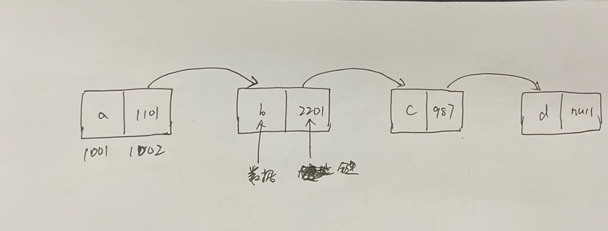
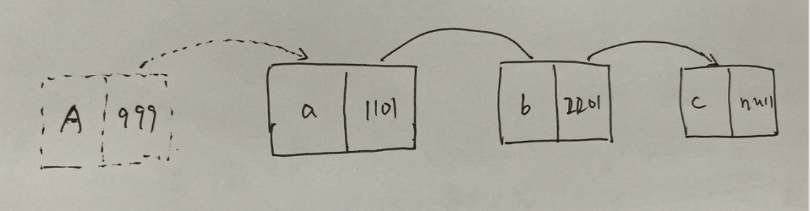
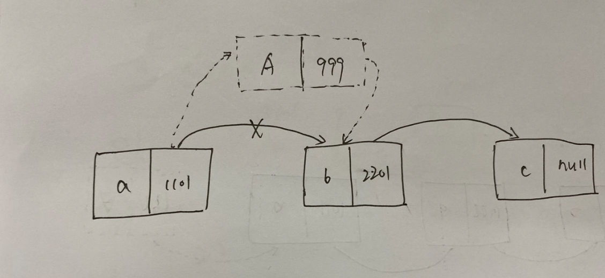

## 数据结构基本概念

数组是计算机科学中最基本的数据结构之一，我们经常会用一些名为**索引**的数字来标识每项数据在数组中的位置。在 Java 编程语言中，索引一般是从 0 开始算起的。

```java
String[] a = new String[]{"hello", "world"};
```

在上述的代码中，hello 字符串的索引位为 0，world 的索引位为 1。


## 数据结构的四种操作

一般的数据结构都有以下的 4 种操作

- **读取**：查看数据结构中某一位置的功能。对于数组来说，这意味着查看某个索引位所指向的数据值。
- **查找**：从某种数据结构中找出某个数据值的所在。对于数组来说，这意味着检查其是否包含某个值。如果包含值，则还需要给出其索引。
- **插入**：给数据结构增加一个数据值。对于数组来说，这意味着多加一个格子并填入一个值。
- **删除**：从数据结构中一走一个数据值。对于数据来说，这意味着把数组中的某个数据项移走。


> 注意一个概念：**操作的速度，并不是按照时间来计算，而是按照步数来计算。**另外，操作的速度也被称之为**时间复杂度**。

因为同样一段代码在不同性能的机器上，运行的时间可能不一致。但这并不能认定这段代码一定是效率低下的。运行的时间受硬件影响，并不可靠。

但是如果按照步数来算，则会准确很多。如果 A 操作需要 5 步，B 操作需要 100 步，那么可以很肯定的说，无论在什么样的硬件上对比，A 都快过 B。因此，衡量步数是分析速度的关键。


## 数组的基本操作

### 1.读取

从数组中读取数据，就是查看数组中某个索引所指向的值，这其实只需要一步。因为计算机本身具有跳转到任一索引位置的能力。在 `String[] a = new String[]{"apple", "banana", "orange", "hello"}` 这个数组中，如果要查看索引 2 的值，计算机会直接跳转到 索引 2 的位置。

为什么计算机能直接跳转到到索引 2 呢？原因如下：

计算机的内存可以看成一个围棋盘，里面是网格。如下图：



其中某一些格子有数据，某一些格子没有数据。当我们想申明一个数组时，计算机会帮我们划**分出一块连续的格子**来供我们使用。


换句话说，当我们想存入一个包含 5 个元素的数组，计算机就会找出 5 个排成一行的空格子，将其当成数组。



内存中的每一个格子都有自己各自的地址，就像街道地址一样。比如露甲山路 8 号。如下图所示，我们的地址使用了 4 位数的数字来表示。（实际存储的地址可能复杂很多，这里方便演示）



那么 a 中的地址和索引表示如下



计算机只所以能直接读取数组中某个索引的位置，主要是具备了以下条件：

- 计算机可以直接一步跳到任意一个内存地址上。（这就好比你要去露甲山路 8 号，知道地址了直接冲过去。）
- 数组本身是会直接记住第一个格子的内存地址。因此计算机知道这个数组的起始位在哪里。
- 数组的索引从 0 开始算起。
- 数组是一块连续的空间。

那么当我们要获取第 3 个索引的位置时，计算机会做如下的计算动作。

1. 数组索引从 0 开始算起，起始位的地址为 1147。
2. 数组索引为 3 在索引为 0 后的第三个格子上。
3. 所以索引 3 的内存地址为 1147 + 3*1 = 1150，知道地址了计算机就会直接去 1150 拿人了。

综上：数组的查找是一种非常高效的动作，往往只需要一步就能完成。不管取的是哪个位置的索引，计算机都能一步到位，

时间复杂度为 O(1)。

### 2.查找

如前面所说，对于数组来说，它的查找就是要检查数组中是否包含某个值。如果包含，需要给出索引。如果我们要检查 hello 这个字符串是否在数组中，对于人眼来说，我们一眼就能知道 hello 这个字符串在数组中，并且它的索引位是 3。

但是计算机并没有眼睛，它只能一步一步检查整个数组。

那么当我们需要直到 hello 在不在数组中时，计算往往会做如下的计算动作。

- 检查第一个索引的值为 apple，不匹配 hello，计算机跳转到下一个索引。
- 检查第二个索引的值为 banana，不匹配 hello，计算机跳转到下一个索引。
- 检查第三个索引的值为 orange，不匹陪 hello，计算机跳转到下一个索引。
- 检查第四个索引的值为 hello，匹配，返回索引值。

在这个例子中，我们共执行了 4 步才匹配到我们想要的值，所以这次操作的总计是 4 步。这种逐个去检查的做法，称之为**线性查找**。

可以考虑一下，在数组上进行线性查找，我们最多需要几步呢？

对于一个长度为 5 个数组来说，数值刚好在最后一个格子里，那么需要 5 步才能查找到（如果不存在，也最多需要 5 步）

对于一个长度为 100 的数组来说，数值刚好在最后一个格子里，那么需要 100 步才能查找到（如果不存在，也最多需要 100 步）

以此类推，一个长度为 N 的数组，其查找的步数最多是 N（N 是任何自然数）。

综上：无论是多长的数组，查找都要比读取慢。因为读取永远只需要一步，而查找可能需要多步。所以计算机的读取的时间复杂度为 O(N)

### 3.插入

往数组里面插入一个数值，往往取决于你想把它插入到数组的哪一个位置上。

- 如果插到末尾，那么只需要一步即可完成，计算机知道你要插入元素的开头地址，只需要计算插入地址，跳转到该地址进行插入即可。

但是如果插入到开头或者中间，则需要另当别论。

如果插入到数组开头，计算机需要移动已经存在的元素腾出空间来进行插入，需要花费额外的步数。

例如往 `String[] a = new String[]{"apple", "banana", "orange", "hello"}` 索引 2 位置插入 world 字符串。



为了达到目的，我们先要将 `"orange" `和 `"hello"` 字符串先往后移动，以便空出索引位 2。当然这也不是一步便可以移动到位的，我们需要先将 `"hello"` 向后移动一位，然后将 `"orange"` 向后移动一位，最后才能执行 `"hello"` 的插入。

整个过程耗费了 3 步，前两步移动元素，后一步插入元素。效率最低（耗费步数最多）的当属在数组头部插入，在数组头部插入需要移动所有元素，按照上面的数组来说，插入到头部所耗费的步数就是 4 + 1 = 5。

综上：一个含有 N 个元素的数组，插入一个值最坏会耗费 N+1 步。即插入过程在数组的开头，导致了 N 次移动，一次插入。所以时间复杂度为 O(N)

### 4.删除

数组中的删除其实就是插入的反向操作。

在数据的末尾删除元素，直接计算删除即可。坏的情况是在中间删除。比如我们要删除 `"orange"` 这个字符串，直接计算删除，一步就可以完成。但是这带来了新的问题。因为数组中间是不允许有空格的，所以我们还需要移动元素。

和插入一样，效率最低（耗费步数最多）的当属在数组头部删除，在数组头部删除需要移动所有元素，按照上面的数组来说，删除头部元素所耗费的步数就是 （4-1）+ 1 = 4，删除一步，移动三步。

综上：一个含有 N 个元素的数组，删除一个值最坏会耗费 N 步。即删除过程在数组的开头，导致了一次删除，N-1 次移动。所以时间复杂度为 O(N)。


## 链表的基本操作

链表和数组一样，链表也用来表示一系列的元素。事实上，能使用数组做的事情，一般也可以使用链表来做。然而，链表的实现和数组是不一样的，在不同的场景里面，它和数组有不同的性能表现。

在数组中我们说了，计算机的内存就像一堆格子，每个格子都可以用来保存比特形式的数组。当要创建数组时，程序会在内存中找出一组连续的空格子，给它们起名字，方便应用存放数据。

与数组不同的是，**组成链表的格子是不连续的**。它可以分布在内存的各个地方，这些不相邻的格子，我们称之为**节点（Node）**。那么问题来了，计算机怎么知道这些分布的节点是属于哪个链表的呢？

这就是链表的关键了：**链表的每个节点除了保存数据，它还保存着链表里面下一个节点的内存地址。**

这份用来指示下一个节点的内存地址的额外数据，被称之为链。链表如下图所示。




上图中，我们的链表包含 4 项数据："a"、"b"、"c"、"d"。因为每个节点都需要两个格子，第一个格子用来存储数据，下一个节点用来存储指向下一个节点的链。（最后一个节点的链为 null），所以整理占用了 8 个格子。

链表相对于数组的一个好处就是，它可以将数据分散在内存的各个部分，而不必事先去寻找连续的区间用来存储数据。

### 1.读取

对于数组的查找，我们知道计算机能够通过计算迅速定位到某一个索引位位置的元素。但是因为链表是不连续存储单元，那么想要找到链表中的某一个元素，除了遍历别无他法。

如果要读取链表中索引位为 2 的元素，计算机会先在链表中先找到第一个节点，根据第一个节点里面的链查找到第二个节点，根据第二个节点才能找到第三个节点（即索引位为 2 的节点）。

读取链表中某个索引值最坏的情况，应该是读取链表的最后一个索引。在这情况下，计算机得从第一个节点开始，沿着链一直读取到最后一个节点，于是需要 N 步。

综上：读取一个元素的时间复杂度为 O(N)。这跟数组的 O(1) 相比较，确实是劣势。

### 2.查找

明白了链表的读取后，不难想到，查找和读取差不多。所谓的查找就是从列表中找到某个特定值所在的索引。对于数组和链表来说，他们都是从第一格开始逐个格子去查找，直到找到。如果是最坏的情况，即找到所在值的末尾，或者完全不在列表中，那就需要花费 O(N) 步。

综上：查找一个元素的时间复杂度为 O(N)。这点跟数组一样。

### 3.插入

在某些情况下，链表的插入和数组相比，有明显的优势。插入数组时最坏的情况：当插入元素在数组的开头时（即索引位为 0），因为需要先讲插入位置右侧的数据都向右移一格，所以会导致 O(N) 的时间复杂度。但是若在链表的表头插入，则只需要一步，即 O(1)。

如图所示：



只需要创建一个新的节点 A，将 A 的节点的链连接到 a 的那一个节点。

但是并非所有的插入都只需要一步，例如在 a 和 b 中间插入



要先把 a 连接到 A 这个节点，同时把 A 链接到 b 这个节点，整个过程耗费了 2 步。

综上：插入的时间复杂度为 O(1)。

### 4.删除

既然明白了插入，那么删除同理，移除对应的节点即可。在头部或者尾部删除，只需要执行一步即可删除节点。在链表的中间节点删除，那么同样也需要 2 步。

综上：删除的时间复杂度为 O(1)。


## 链表和数组的区别

通过上面的分析，我们可以知道数组和链表有如下的区别：

|          | 数组                   | 链表                     |
| -------- | ---------------------- | ------------------------ |
| 存储方式 | 一段连续的内存存储空间 | 随机分配在计算机的内存中 |
| 插入效率 | O(N)                   | O(1)                     |
| 删除效率 | O(N)                   | O(1)                     |
| 读取效率 | O(1)                   | O(N)                     |
| 查找效率 | O(N)                   | O(N)                     |

所以相比较来说

- 如果插入删除操作较多，推荐使用链表来存储
- 如果读取操作较多，推荐使用数组
- 至于查找，因为两者效率一致，两者均可