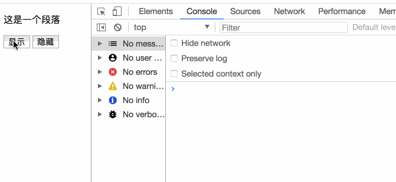
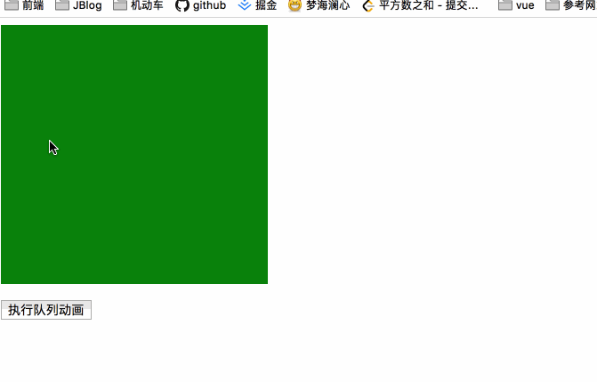

### JQuery 效果

`JQuery` 效果包含隐藏，显示，切换，滑动，淡入淡出以及动画。

#### JQuery 隐藏和显示

> hide() 和 show()

```javascript
// 文档加载完成后执行
$(function(){
    $('#show').click(function(){
        $('p').show();
    });
    $('#hide').click(function() {
        $('p').hide();
    });
});
```

```html
<p>这是一个段落</p>
<button id="show">显示</button>
<button id="hide">隐藏</button>
```

语法：

```javascript
// speed 表示隐藏/显示的时间，也就是说在几秒内显示/隐藏，callback 表示显示/隐藏后的回调方法
$(selector).hide(speed, callback);
$(selector).show(speed, callback);
```

例如：

```javascript
$(function(){
    $('#show').click(function(){
        $('p').show(2000, function(){
            console.log("显示啦");
        });
    });
    $('#hide').click(function() {
        $('p').hide(2000, function(){
            console.log('隐藏啦');
        });
    });
});
```

执行效果如下：




**注意：你也可以使用 toggle 方法来控制显示或者隐藏**

```javascript
// 2000 表示显示或者隐藏需要的时间 function 表示执行完成显示或者隐藏后执行的代码。
$('#toggle').click(function(){
    $('p').toggle(2000, function(){
        console.log("显示/隐藏");
    });
});
```

格式：

```javascript
$(selector).toggle(speed, callback);
```


#### JQuery 淡入/淡出

通过 `JQuery` 可以实现淡入淡出的效果。

- fadeIn 淡入

  用于淡入已经隐藏的元素

  语法：

  ```javascript
  // speed 和 callback 同上
  // speed 可取值为 slow fast 或者毫秒值
  $(selector).fadeIn(speed, callback);
  ```

  ```javascript
  $('#fadeIn').click(function(){
      $('p').fadeIn();
      $('p').fadeIn('slow');
      $('p').fadeIn(3000);
  });
  ```

- fadeOut 淡出

  用于淡出已经显示的元素

  用法同 `fadeIn`类似

  ```javascript
  $('#fadeOut').click(function(){
      $('p').fadeOut();
      $('p').fadeOut('slow');
      $('p').fadeOut(3000);
  });
  ```

- fadeToggle

  `fadeToggle` 方法可以在 `fadeIn` 和 `fadeOut` 方法之间进行切换。

  - 如果元素淡出，`fadeToggle` 会给元素添加 `fadeOut` 方法。

  - 如果元素淡入，`fadeToggle` 会给元素添加 `fadeIn` 方法。

    例如：

    ```javascript
    $('#fadeToggle').click(function(){
        $('p').fadeToggle(3000, function(){
            console.log('淡入/淡出');
        });
    });
    ```

    语法：

    ```javascript
    // speed 和 callback 同上
    $(selector).fadeToggle(speed, callback);
    ```

- fadeTo  

  `fadeTo` 方法允许元素渐变成某一个给定的不透明值（0-1）

  ```javascript
  $('#fadeTo').click(function(){
  	$('p').fadeTo('slow', 0.5);
  });
  ```

#### JQuery 滑动

`JQuery` 拥有以下的滑动方法：`slideDown()`，`slideUp()`，`slideToggle()`

语法：

```javascript
// speed 和 callback 同上
$(selector).slideDown(speed, callback);
$(selector).slideUp(speed, callback);
$(selector).slideToggle(speed, callback);
```

```javascript
$(function(){
    $('#slide').click(function(){
        //                $('#content').slideUp();
        //                $('#content').slideDown();
        $('#content').slideToggle();
    });
});
```

```html
<div id="slide">点我显示滑动</div>
<div id="content">这是一段文字</div>
```

#### JQuery 动画

`JQuery`中的 `animate()` 方法允许创建自定义的动画。

语法：

```javascript
// params 参数定义形成动画的 css 属性
// speed 可选值为 fast slow 以及毫秒数，表示动画执行的时间
// callback 表示动画执行完成后的回调函数
$(selector).animate({params}, speed, callback);
```

例如：让 `div` 距左边距 `250px`

```javascript
$('#animate').click(function(){
    $('#content').animate({marginLeft: '250px'});
});
```

**同样动画可以同时操作多个属性。**例如：

```javascript
$('#animate').click(function(){
    $('#content').animate({marginLeft: '250px', height: '300px', width: '300px'});
});
```


> animate 可以操作几乎全部的 css 属性，但是必须要注意的一点就是操作属性必须是以驼峰来命名的 css 属性。例如 margin-left 需要写成 marginLeft。
>
> 另外，还需要注意的一点： animate 不支持改变颜色，如果需要改变颜色，需要另外的 jquery 插件。

**jquery 还可以在 animate 上定义相对值**

使用 `+=` 或者 `-=` 来定义相对值。例如：

```javascript
$('#animate').click(function(){
   $('#content').animate({width: '+= 200px'});
});
```

**jquery animate() 使用队列功能**

如果你编写了多个 `animate()` 方法，`jquery` 会创建包含这些方法的内部队列，各个动画依次执行。

```javascript
$(document).ready(function(){
    $('#animate-queen').click(function(){
        $('div').animate({width: '300px', opacity: '0.5'},'slow');
        $('div').animate({height: '300px', opacity: '1'},'slow');
        $('div').animate({width: '100px', opacity: '0.5'},'slow');
        $('div').animate({height: '100px', opacity: '1'},'slow');
    });
});
```

```html
<div id="app">

</div>
<br>
<button id="animate-queen">执行队列动画</button>
```



