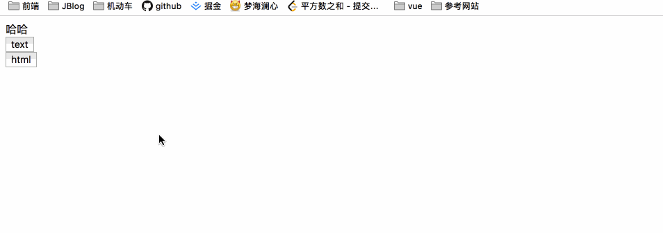
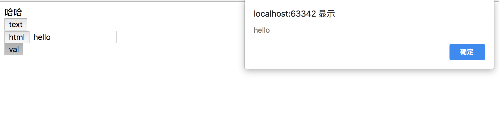
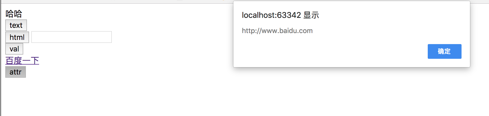
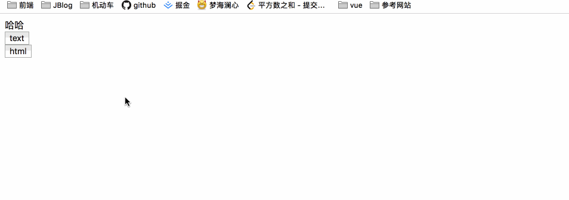
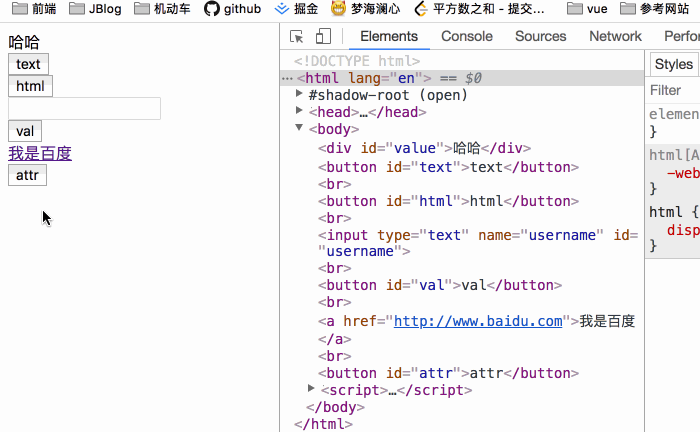
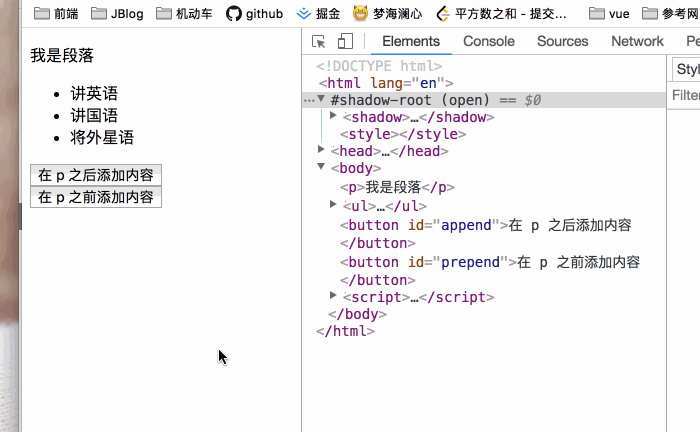
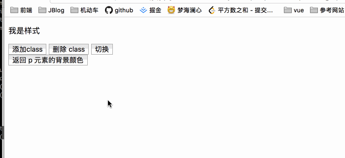

### JQuery 获取内容和属性

`JQuery` 中非常重要的一部分，就是操作 `DOM` 的能力。

#### 获取内容-text()、html() 和 val()

- text() 设置或者返回所选元素的文本内容
- html() 设置或者返回所选元素的内容（包括 html 标记）
- val() 设置或者返回表单字段的值

```javascript
$(document).ready(function(){
    $('#text').click(function(){
        alert($('#test').text());
    }) ;

    $('#html').click(function(){
        alert($('#test').html());
    });
});
```

```html
<div id="test">哈哈</div>
<button id="text">text</button>
<br>
<button id="html">html</button>
```



通过 `val()` 获取输入字段的值。

```javascript
$('#val').click(function(){
    alert($('#username').val());
});
```



#### 获取属性 attr()

`attr()` 用于获取 `html` 标签的属性值。例如获取 `a` 标签的 `href` 属性值。

```javascript
$('#attr').click(function(){
    alert($('#a').attr('href'));
});
```

```html
<a id="a" href="http://www.baidu.com">百度一下</a><br>
<button id="attr">attr</button>
```




#### 设置内容 html()、text() 以及 val()

```javascript
$(document).ready(function(){
    $('#text').click(function(){
        $('#value').text('你好');
    });

    $('#html').click(function(){
        $('#value').html('<strong>你好世界</strong>');
    });
});
```

```html
<div id="value">哈哈</div>
<button id="text">text</button>
<br>
<button id="html">html</button>
```



`val()` 给表单设置值。

```javascript
$('#val').click(function(){
    $('#username').val('admin');
});
```

```html
<input type="text" name="username" id="username"/><br>
<button id="val">val</button>
```

 

#### 设置属性 attr

```javascript
$('#attr').click(function(){
    $('a').attr('href', 'https://www.jd.com');
});
```

```html
<a href="http://www.baidu.com">我是百度</a><br>
<button id="attr">attr</button>
```



```javascript
$('#attr').click(function(){
    $('a').attr({
        'href': 'https://www.jd.com',
        'id': 'haha'
    });
});
```


`attr()` 以及 `val()`，`html()`，`text()` 都有回调函数，但是回调函数我们一般用不到，略过。


### JQuery 添加元素

通过 `JQuery` 我们可以很方便的添加新元素/内容

- `append()` - 在备选元素的结尾插入内容。
- `prepend()` - 在备选元素之前插入内容。
- `after()` - 在备选元素之后插入内容。
- `before()` - 在备选元素之前插入内容。

```javascript
$(document).ready(function(){
    $('#append').click(function(){
        $('p').append(' <= 我是尾部');
    });

    $('#prepend').click(function(){
        $('p').prepend('我是头部 => ');
    });
});
```

```html
<p>我是段落</p>
<ul>
    <li>讲英语</li>
    <li>讲国语</li>
    <li>将外星语</li>
</ul>

<button id="append">在 p 之后添加内容</button>
<button id="prepend">在 p 之前添加内容</button>
```




**`after()` `before()` 方法**

```javascript
$('#before').click(function(){
    $('img').before('<p>我是图片之前的文字</p>');
});
$('#after').click(function(){
    $('img').after('<p>我是图片之后的文字</p>');
});
```

```html

<br>
<button id="before">在 image 后添加元素</button>
<br>
<button id="after">在 image 前添加元素</button>
```

在图片前后添加 `p` 标签。

#### JQuery 删除元素

- `remove()` 删除元素
- `empty()` 删除子元素

```javascript
$(document).ready(function(){
    $('#delete1').click(function(){
        $('p').remove();
    });

    $('#delete2').click(function(){
        $('ul').empty();
    });
});
```

```html
<p>删除我</p>
<button id="delete1">删除 p 元素</button>
<ul>
    <li>第一项</li>
    <li>第二项</li>
    <li>第三项</li>
</ul>
<button id="delete2">删除全部子元素</button>
```

- 有选择性的删除元素

  ```javascript
  $(document).ready(function(){
      $('#delete1').click(function(){
          $('p').remove('.demo');
      });
  });
  ```

  删除所有带有 `class = demo` 的 `p` 元素。

#### JQuery 操作 CSS

- addClass() 向备选元素添加一个或者多个类。
- removeClass() 向备选元素删除一个或者多个类。
- toggleClass() 对备选元素进行添加/删除类的切换。
- css() 设置或者返回样式属性。

```javascript
$(document).ready(function(){
   $('#addClass').click(function(){
        $('p').addClass('demo1');
   });

   $('#deleteClass').click(function(){
        $('p').removeClass('demo1');
   });
});
```

```html
<p>我是样式</p>

<button id="addClass">添加class</button>
<button id="deleteClass">删除 class</button>
```

```css
.demo1{
    padding: 4px;
    font-size: 18px;
    background-color: red;
    font-family: '微软雅黑';
}
```


**样式切换  `toggleClass`	**

```javascript
$('#toggleClass').click(function(){
     $('p').toggleClass('demo1');
});
```

添加多个`class`

```javascript
$('#addClass').click(function(){
   $('p').addClass('demo1, demo2'); 
});
```

**css() 方法**

返回/设置当前选中元素的 `css` 属性值。

```javascript
// 返回属性
$('#css1').click(function(){
  alert("背景颜色：" + $('p').css('background-color'));
  alert("字号：" + $('p').css('font-size'));
  alert("字体属性：" + $('p').css('font-family'));
});
```




**设置属性**

```javascript
$('p').css('background-color', 'green');
```

**添加多个属性**

```javascript
$('p').css({'background-color':'green',
   'font-family': '微软雅黑',
    'font-size' : '20px'
});
```

