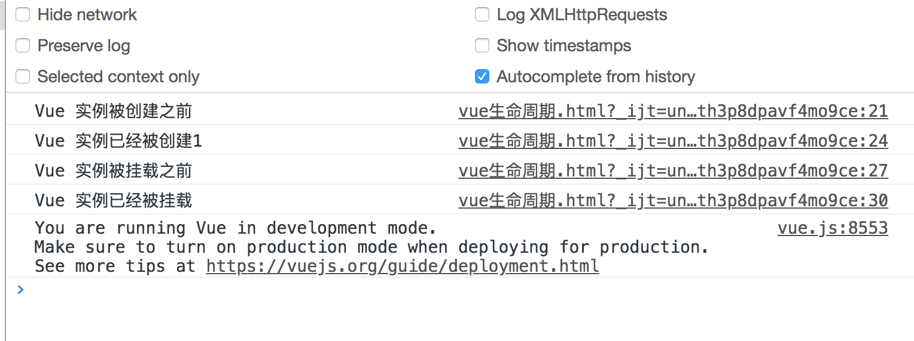

### Vue2 实例生命周期钩子

- created: 当实例被创建的时候执行。

  ```javascript
  <script>
      new Vue({
          el: '#app',
          data: {
              message: 1
          },
          created: function() {
              console.log('Vue 实例已经被创建' + this.message)
          }
      })
  </script>
  ```

  除了 `created`  生命周期方法之外，还有其他的生命周期方法：例如 `mounted`，`updated` 以及 `destoryed` 。生命周期钩子的 `this` 指向调用他的 `Vue` 实例。

- 生命周期方法图示

  

- 调用其他生命周期方法

  ```javascript
  <script>
      new Vue({
          el: '#app',
          data: {
              message: 1
          },
          beforeCreate: function(){
            console.log('Vue 实例被创建之前')
          },
          created: function() {
              console.log('Vue 实例已经被创建')
          },
          beforeMount: function(){
              console.log('Vue 实例被挂载之前')
          },
          mounted: function() {
              console.log('Vue 实例已经被挂载')
          }
      })
  </script>
  ```

- 运行截图

  

