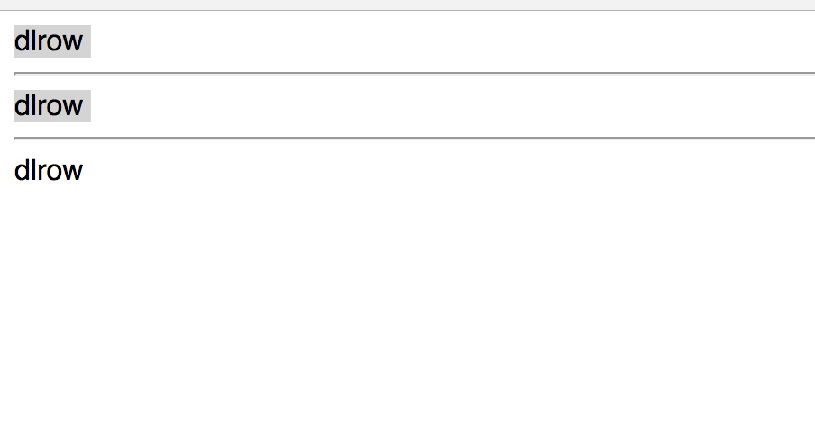
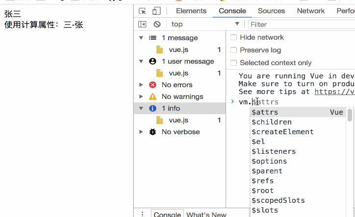
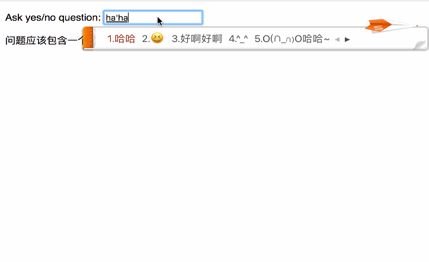

### Vue2 计算属性

使用模板的初衷是用于简单运算的，但是如果我们在 `{{}}` 中放入太多的业务就会让那表达式过于臃肿。例如下面的例子：

```vue
 <div id="#app">
 	{{ message.split('').reverse().join('') }}
 </div>
```

简单的反转字符串的例子，如果我们在页面上多次使用反转字符串，会使页面变得杂乱不堪，难以维护。因此对于复杂的逻辑，应当使用**计算属性**。

```vue
<div id="app">
    {{ message.split('').reverse().join('') }}
    <hr>
    {{ reverseMessage }}
</div>
```

```javascript
<script>
    var vm = new Vue({
        el: '#app',
        data: {
            message: 'hello world'
        },
        computed: {
            // reverseMessage 为返回值，这里调用的是计算属性的 getter 方法
            reverseMessage: function () {
                // this 表示的是当前 vue 的实例对象, 也就是 vm
                return this.message.split('').reverse().join('');
            }
        }
    })
</script>
```

这样，如果我们的页面需要多次调用反转字符串的方法，直接使用 `{{ reverseMessage }}` 插值即可。


如果我们在标签中使用方法好像也同样可以达到我们的目的。例如：

```java
<script>
    new Vue({
        el: '#app',
        data: {
            message: 'world'
        },
        // 这里是计算属性
        computed: {
            reverseMessage: function () {
                return this.message.split('').reverse().join('');
            }
        },
        // 这里是方法
        methods: {
            reverseMessage2: function() {
                return this.message.split('').reverse().join('');
            }
        }
    })
</script>
```

```vue
<div id="app">
    {{ message.split('').reverse().join('') }}
    <hr>
    {{ reverseMessage }} <!-- 这里调用的是计算属性 -->
    <hr>
    {{ reverseMessage2() }} <!-- 这里调用的方法 -->
</div>
```

运行结果



既然都能达到目的，那么计算属性和方法有什么区别？

------

### 计算属性 computed 和方法 methods 的区别

计算属性是**基于他们的依赖进行缓存的**，也就是说如果 `message` 的值没有发生变化，多次访问 `reverseMessage` ，计算属性会立即返回之前的计算结果，而方法是每次访问都进行计算的。

> 也就是说：计算属性（computed） 是自身有缓存的，如果你不希望有缓存，可以用方法来替代计算属性。

------

### 侦听属性（watch）

有这样的需求，A 对 B 进行观察，当 B 的值发生变化的时候，A 需要做出相应的动作。这点类似于 `java ` 中的回调函数（callback），`vue` 同样给我们提供了这样的方式，它就是侦听属性。

- 侦听属性版本（watch）

```javascript
<script>
    new Vue({
        el: '#demo',
        data: {
            firstName: '张',
            lastName: '三',
            fullName:'张三'
        },
        watch:{
            firstName: function (val) {
                this.fullName = val + ' ' + this.lastName;
            },
            lastName: function (val) {
                this.fullName = this.firstName + ' ' + val;
            }
        }
    })
</script>
```

```vue
<div id="demo">
    {{ fullName }}
</div>
```

当 `firstName` 或者 `lastName` 发生变化的时候，`fullName`也会相应的发生变化。

你会不会觉得上面的代码是不是太过于繁琐了？这样的功能好像我们使用 `计算属性（computed）`也是可以完成的。

看看实现同样功能，使用计算属性的版本。

- 计算属性实现（computed）

```javascript
<script>
    new Vue({
        el: '#demo',
        data: {
            firstName: '张',
            lastName: '三',
            fullName:'张三'
        },
        watch:{
            firstName: function (val) {
                this.fullName = val + ' ' + this.lastName;
            },
            lastName: function (val) {
                this.fullName = this.firstName + ' ' + val;
            }
        },
        computed: {
            fullName2: function() {
                return this.lastName + '-' + this.firstName
            }
        }
    })
</script>
```

```vue
<div id="demo">
    {{ fullName }}
    <br>
    <span>使用计算属性：{{ fullName2 }}</span>
</div>
```

对比之下，是不是觉得计算属性容易的多？

------

### 计算属性的 setter 方法

默认情况下，计算属性都只提供一个 `getter` 方法，但是在有些时候，你也需要提供一个 `setter` 方法。

```javascript
<script>
    var vm = new Vue({
        el: '#demo',
        data: {
            firstName: '张',
            lastName: '三',
            fullName:'张三'
        },
        computed: {
            fullName2: {
                // getter
                get: function() {
                    return this.lastName + '-' + this.firstName
                },
                // setter
                set: function(val){
                    this.lastName = val
                }
            }
        }
    })
</script>
```

当你在控制台输入 `vm.lastName='四'` 的时候，你会发现页面上的内容发生了变化。此时就是调用了计算属性的 `setter` 方法。



------

### 侦听器

虽然计算属性能够适应大多数的情况，但是还是有极少部分情况是不适合用计算属性来完成的，比如设置中间状态等等。看下面的例子：

```javascript
<script>
    var watchExampleVM = new Vue({
        el: '#watch-example',
        data: {
            question: '',
            answer: '我不能告诉你答案，在你回答这个问题之前'
        },
        watch: {
            question: function(newQuestion, oldQuestion) {
                this.answer = '正在输入...';
                // 限制输入频率
                this.debouncedGetAnswer();
            }
        },
        // 实例被创建的时候，限制了输入的频率
        created: function() {
            // 限制输入的频率
            this.debouncedGetAnswer = _.debounce(this.getAnswer, 500)
        },
        methods: {
            getAnswer: function() {
                if (this.question.indexOf('?') === -1) {
                    this.answer = '问题应该以问号结尾';
                    return
                }
                this.answer = '思考中...';
                var vm = this;

                //这里是做了异步的网络请求
                axios.get('https://yesno.wtf/api')
                    .then(function (response) {
                        vm.answer = _.capitalize(response.data.answer)
                    })
                    .catch(function (error) {
                        vm.answer = '不能访问 api ' + error
                    })
            }
        }
    })
</script>
```

```vue
<div id="watch-example">
    <p>
        Ask yes/no question:
        <input type="text" v-model="question">
    </p>

    <p>{{answer}}</p>
</div>
```

演示结果：



> **使用 `watch` 选项允许我们执行异步操作 (访问一个 API)，限制我们执行该操作的频率，并在我们得到最终结果前，设置中间状态。这些都是计算属性无法做到的。**