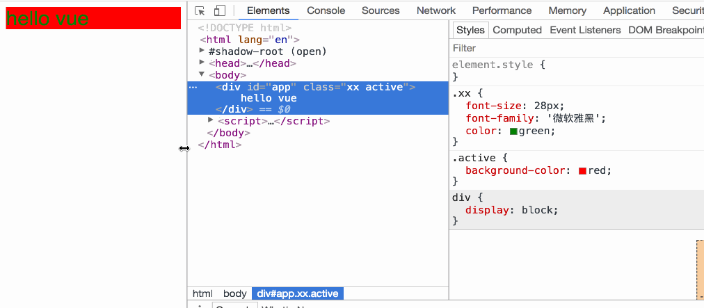
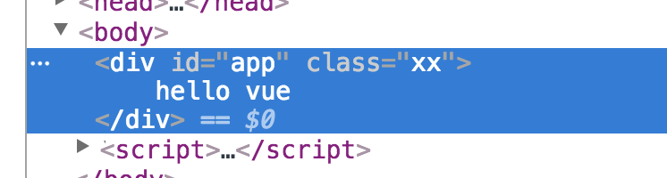
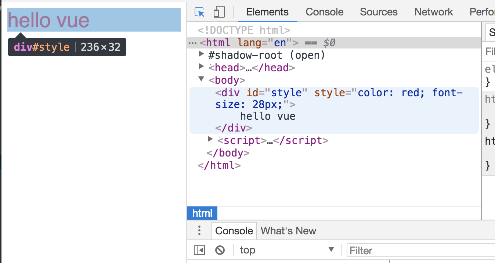
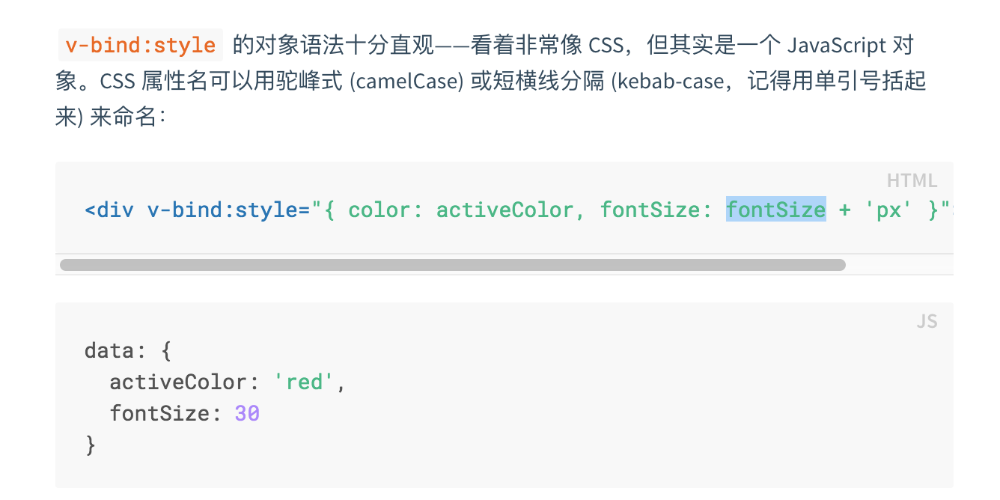
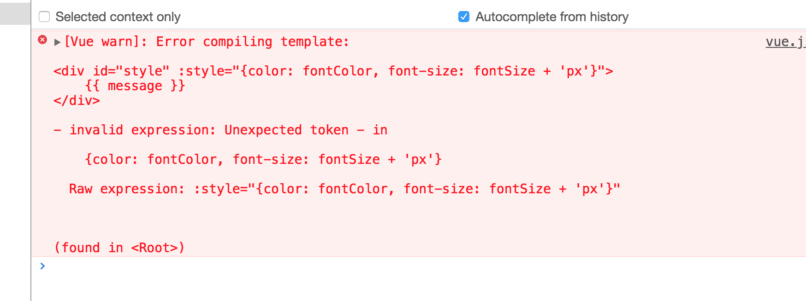
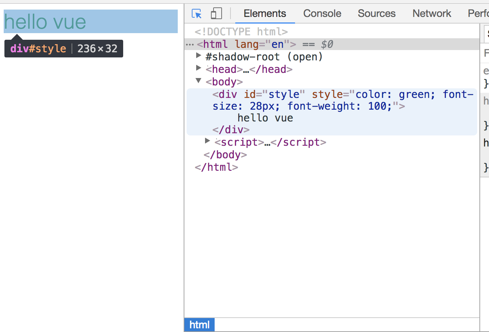

### Vue 绑定 Class 和 Style

很多时候，我们需要动态的绑定样式，例如当我们登录的时候，如果文本框没有输入值，那么我们需要给提交按钮一个样式，当文本框有值的时候，我们需要给按钮另一个样式，这就是动态绑定 `Class`


#### Vue 绑定 HTML Class

- 对象语法

`Vue` 也给我们提供了动态绑定样式的方法。例如：

```vue
<!-- 当 isActive 的值为 true 的时候，这个 div 就有 xx 和 active 这两个 class 属性 -->
<div id="app" class="xx" v-bind:class="{active: isActive}">
    {{ message }}
</div>
```

```javascript
<script>
    var vm = new Vue({
        el: '#app',
        data: {
            isActive: true,
            message: 'hello vue'
        }
    })
</script>
```

现在 `isActive` 的值为 `true`，我们用检查的方式来查看该元素。看图，一切就都明白了



当 `isActive` 的值发生变化的时候，视图也会相应的更新。

------


绑定的数据不必内联在模板中，例如这样也是有效的，渲染的结果和上面的一样。

```javascript
<script>
    var vm = new Vue({
        el: '#app',
        data: {
            // class 和数据分离开来
            classObject:{
                isActive: true,
                error: true
            },
            message: 'hello vue',

        }
    })
</script>
```

```vue
<div id="app" class="xx" v-bind:class="classObject">
    {{ message }}
</div>
<!-- 可以简写 -->
<div id="app" class="xx" :class="classObject">
    {{ message }}
</div>
```


还可以和计算属性一起使用，例如下面的：

```javascript
<script>
    var vm = new Vue({
        el: '#app',
        data: {
            isActive: true,
            error: true,
            message: 'hello vue'
        },
        computed: {
            classObject: function(){
                return {
                    active: this.isActive && !this.error,
                }
            }
        }
    })
</script>
```

```vue
<div id="app" class="xx" :class="classObject">
    {{ message }}
</div>
```

渲染结果：



```javascript
// 这段代码渲染出来的结果 isActive = true， !error = false, 因此 active 是 false，所以没有给 div 添加 active 这个 class
active: this.isActive && !this.error
```

- 数组语法

  可以把一个数组传给 `v-bind:class`，以应用一个列表：

  ```vue
  <div v-bind:class='[activeClass, errorClass]'></div>
  ```

  ```javascript
  data: {
      activeClass: 'active',
      errorClass: error
  }
  ```

  那么渲染出来的结果就是：

  ```html
  <div class='active error'></div>
  ```

  如果想利用条件来切换 `class`，可以这样切换：

  ```vue
  <div v-bind:class='[isActive ? activeClass : '', errorClass]'></div>
  ```

  ```javascript
  data: { 
  	isActive: false,
  	activeClass: 'active',
  	errorClass: 'error'
  }
  ```

  渲染结果：

  ```html
  <div class='error'></div>
  ```

  

  如果有多个条件 `Class` 的话，这样写会比较繁琐，此时我们可以在数组中包含对象的写法，例如：

  ```vue
  <div :class='[{active: isActive}, errorClass]'></div>
  ```

- 用在组件上

  还记得我们是如何定义全局组件的么？

  ```javascript
  Vue.component('my-component', {
      template: '<h1 class='xx, xy'>我是自定义的组件</h1>'
  })
  ```

  如何使用呢？

  ```vue
  <my-component class='ab, ac'></my-component>
  ```

  此时将会被渲染成

  ```html
  <h1 class='ab, ac, xx, xy'>我是自定义的组件</h1>
  ```

  > 同样动态绑定 Class 对组件也同样适用


#### Vue 绑定内联样式

绑定内联样式比较简单，看起来很像 `css` 语法，但是实际上来说不是的，它是 `javascript` 对象。先来个例子吧，例如：

```vue
<script>
    new Vue({
        el: '#style',
        data: {
            fontColor: 'red',
            fontSize: 28,
            message: 'hello vue'
        }
    })
</script>
```

```vue
<div id="style" :style="{color: fontColor, fontSize: fontSize + 'px'}">
    {{ message }}
</div>
```

渲染结果：




> 这里需要注意一下：官网的描述



> 官网说可以用驼峰式（camelCase）或者短横线分隔（kebab-case），这里我测试了会报错，目前还不知道原因，如果有人知道，还请告知。（不知道是版本问题还是我操作姿势有问题）

```vue
<!-- font-size 使用短横线分割 -->
<div id="style" :style="{color: fontColor, font-size: fontSize + 'px'}">
    {{ message }}
</div>
```

报错截图：




上面的写法可能比较繁琐，通常我们会直接绑定一个样式对象，这样更加清晰。

```vue
<script>
    new Vue({
        el: '#style',
        data: {
            styleObject: {
                color: 'green',
                fontSize: '28px',
                fontWeight: 100
            },
            message: 'hello vue'
        }
    })
</script>
```

```vue
<div id="style" :style="styleObject">
    {{ message }}
</div>
```

> 注意：styleObject 中的 fontSize 这种类型的 css 属性，也只能用驼峰，不能用短横线。

演示图：

