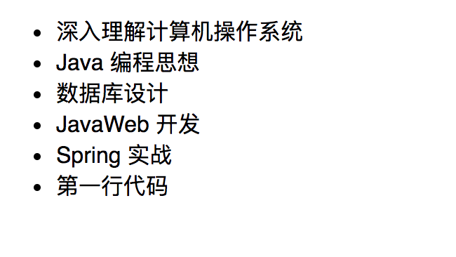
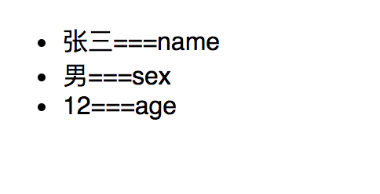
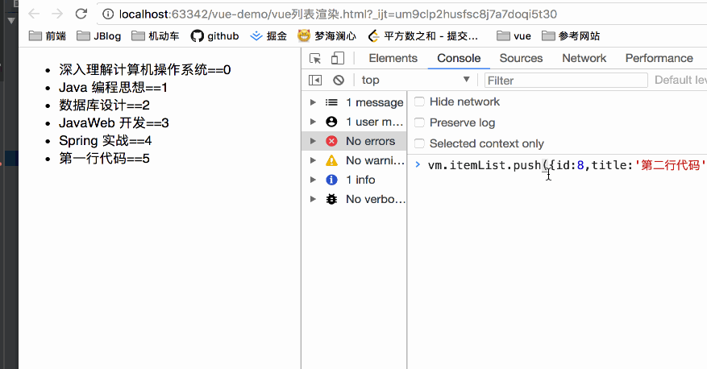
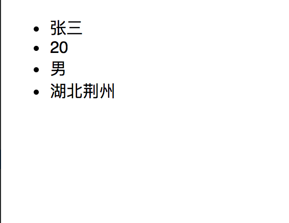

### Vue 渲染列表

#### v-for 列表渲染遍历数组

```vue
<ul id="example-list">
    <li v-for="item in itemList" :key="item.id">{{ item.title }}</li>
</ul>
```

```vue
<script>
    new Vue({
        el: '#example-list',
        data: {
            itemList: [
                {id:1, title: '深入理解计算机操作系统'},
                {id:2, title: 'Java 编程思想'},
                {id:3, title: '数据库设计'},
                {id:4, title: 'JavaWeb 开发'},
                {id:5, title: 'Spring 实战'},
                {id:6, title: '第一行代码'}
            ]
        }
    })
</script>
```

运行结果：



**注意：可以使用 of 代替 in，例如下面的写法**

```vue
<ul id="example-list">
    <li v-for="item of itemList" :key="item.id">{{ item.title }}</li>
</ul>
```

另外，还可以知道当前遍历元素的索引位：

```vue
<!-- 
	:key 是为了提高遍历的效率以及复用，类似于 vue1.x 中的 'track-by=$index'
-->
<ul id="example-list">
    <li v-for="(item, index) of itemList" :key="item.id">{{ item.title }}==={{index}}</li>
</ul>
```


#### v-for 遍历对象

```vue
<ul id="example-list">
    <li v-for="(item, index) of personObject" >{{ item }}==={{index}}</li>
</ul>
```

```vue
<script>
    new Vue({
        el: '#example-list',
        data: {
            itemList: [
                {id:1, title: '深入理解计算机操作系统'},
                {id:2, title: 'Java 编程思想'},
                {id:3, title: '数据库设计'},
                {id:4, title: 'JavaWeb 开发'},
                {id:5, title: 'Spring 实战'},
                {id:6, title: '第一行代码'}
            ],
            personObject: {
                name: '张三',
                sex: '男',
                age: 12
            }
        }
    })
</script>
```




#### 数组更新检测

- 变异方法

  在 `vue` 中提供了一组观察数组变异的方法，所以它们被调用的时候，也会触发视图的更新。

  ```vue
  push()
  pop()
  shift()
  unshift()
  splice()
  sort()
  reverse()
  ```

  


- 替换数组

  变异方法 (mutation method)，顾名思义，会改变被这些方法调用的原始数组。相比之下，也有非变异 (non-mutating method) 方法，例如：`filter()`, `concat()` 和 `slice()`。这些不会改变原始数组，但**总是返回一个新数组**。当使用非变异方法时，可以用新数组替换旧数组：

关于这些方法的含义，见 `JavaScript`


#### 对象更改检测注意事项

由于`JavaScript` 的限制，**vue 不能检测对象属性的添加或者删除**。例如：

```vue
<script>
    var vm = new Vue({
        el: '#app',
        data: {
            a: 1
        }
    });
    // vm.a 现在还是响应式的
    console.log(vm.a);
    // vm.b 不是响应式的
    vm.b = 2
</script>	
```


对于已经创建的实例，`Vue` 不能动态添加根级别的响应式属性。但是，可以使用 `Vue.set(object, key, value)` 方法向嵌套对象添加响应式属性。例如，对于：

```vue
<ul id="app">
   <li v-for="value of personObject">{{ value }}</li>
</ul>
```

```vue
<script>
    var vm = new Vue({
        el: '#app',
        data: {
            personObject: {
                name: '张三',
                age: 20
            }
        }
    });
    vm.$set(vm.personObject, 'sex', '男');
    Vue.set(vm.personObject, 'address', '湖北荆州');
</script>
```



**注意：vm.$set() 和 Vue.set 是一样的，后者是一个全局方法，前者是它的别名 **


有时你可能需要为已有对象赋予多个新属性，比如使用 `Object.assign()` 或 `_.extend()`。在这种情况下，**你应该用两个对象的属性创建一个新的对象。**

```vue
<script>
    var vm = new Vue({
        el: '#app',
        data: {
            personObject: {
                name: '张三',
                age: 20
            }
        }
    });
    vm.$set(vm.personObject, 'sex', '男');
    Vue.set(vm.personObject, 'address', '湖北荆州');

    // 添加多个属性
    vm.personObject = Object.assign({}, vm.personObject, {
        phone: '120',
        email: '123@qq.com'
    })
</script>
```

