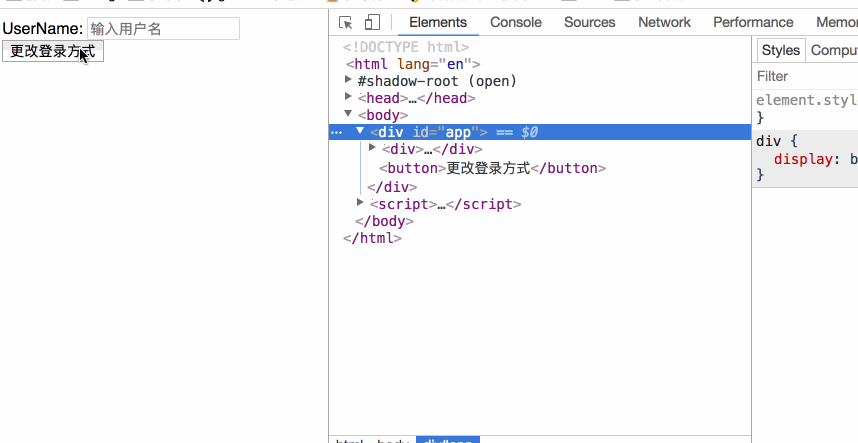
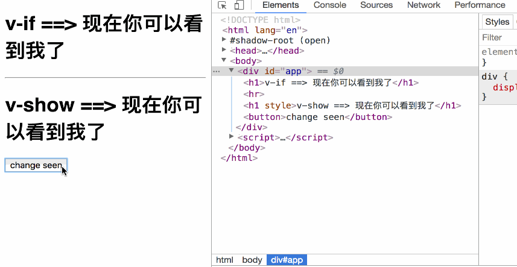

### 条件渲染

在 `java` 中，我们使用 `if else` 或者 `switch case` 来实现条件分支，在 `vue` 中，`vue` 也提供了条件渲染的功能。

#### v-if/v-else 条件渲染

```vue
<h1 v-if='seen'>现在你可以看到我了</h1>
```

```vue
<script>
    new Vue({
        el: '#app',
        data: {
            seen: true
        }
    })
</script>
```

当 `seen` 为 `true` 的时候，`h1` 标签中的内容可见，反之，不可见。


同样，我们可以给其添加一个 `else` 块。例如：

```vue
<div id="app">
    <h1 v-if="seen">现在你可以看到我了</h1>
    <h1 v-else>反之你看不到我</h1>
</div>
```

```vue
<script>
    new Vue({
        el: '#app',
        data: {
            seen: true
        }
    })
</script>
```

当 `seen` 为 `true` 时候，显示 `v-if`，当 `seen` 为 `false` 时，显示 `v-else`

> **注意： `v-else` 元素必须紧跟在带 `v-if` 或者 `v-else-if` 的元素的后面，否则它将不会被识别。** 

#### 在 template 上使用 v-if 进行条件渲染

在普通的 `html` 标签上可以表示，那么在 `template` 上也是可以表示的。例如：

```vue
<template v-if='seen'>
	<h1>这是模板标题</h1>
	<p>
       这是模板内容
    </p>
	<p>
        这是模板尾部
    </p>
</template>
```

可见与不可见仍然由 `seen` 取值决定。


#### 用 key 管理可以复用的元素

在 `使用账户登录` 和 `使用邮箱登录` 这两者之间切换：

```vue
<div id="app">
    <div v-if="loginType === 'username'">
        UserName: <login-account></login-account>
    </div>
    <div v-else>
        Email: <login-email></login-email>
    </div>

    <button @click="change();">更改登录方式</button>
</div>
```

```vue
<script>
    Vue.component('login-account', {
        template: '<input placeholder="输入用户名"/>'
    });

    Vue.component('login-email', {
       template: '<input placeholder="输入邮箱"/>'
    });
    new Vue({
        el: '#app',
        data: {
            loginType: 'username'
        },
        methods: {
            change: function(){
                this.loginType = this.loginType === 'username' ? 'email' : 'username'
            }
        }
    })
</script>
```

演示结果：




#### v-show 控制显示和隐藏

`v-show` 的用法和 `v-if` 基本上是一样的，但是他们也有区别，既然都是控制显示和隐藏，那他们有哪些区别！

```vue
<div id="app">
    <h1 v-if="seen">v-if ==> 现在你可以看到我了</h1>
    <hr>
    <h1 v-show="seen">v-show ==> 现在你可以看到我了</h1>

    <button @click="change();">change seen</button>
</div>
```

```vue
<script>
    new Vue({
        el: '#app',
        data: {
            seen: true
        },
        methods: {
            change: function (){
                this.seen = !this.seen;
            }
        }
    })
</script>
```

运行结果：




看出区别了吗？

> `v-if` 当 `seen` 为 `false` 的时候，不会在 `dom` 中渲染带有 `v-if` 的 `h1` 节点。而 `v-show` 仅仅只是在带有 `v-show` 的 `h1` 节点上添加了一个 `display:none` 属性。

这就是他们俩最大的区别！ 这两种方式在开发中应该都有用到，具体喜欢用哪一种，看自己个人选择。

> 注意：v-show 不支持 <template> 元素。

#### v-if 和 v-show 的较量

`v-if` 是 “真正” 的条件渲染，因为它会确保在切换过程中条件块内的事件监听器和子组件适当地被销毁和重建。

`v-if` 也是 **惰性的**：如果在初始渲染时条件为假，则什么也不做——直到条件第一次变为真时，才会开始渲染条件块。

相比之下，`v-show` 就简单得多——不管初始条件是什么，元素总是会被渲染，并且只是简单地基于 `CSS` 进行切换。

一般来说，`v-if` 有更高的切换开销，而 `v-show` 有更高的初始渲染开销。因此，如果需要非常频繁地切换，则使用 `v-show` 较好；如果在运行时条件很少改变，则使用 `v-if` 较好。