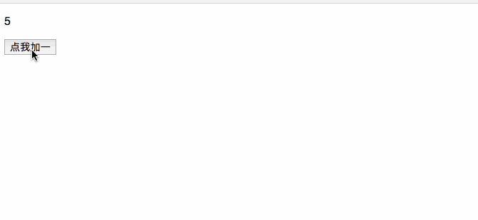
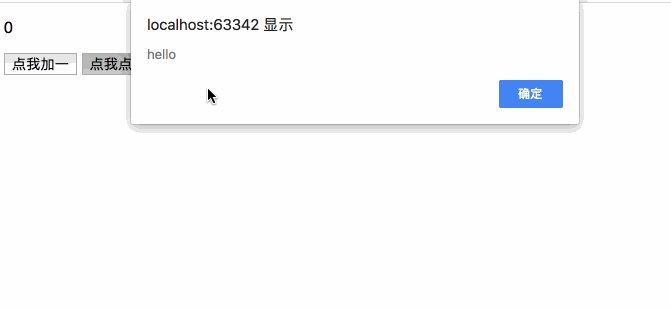
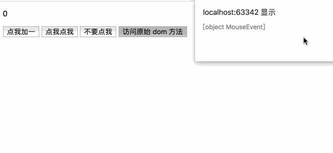

### Vue 事件处理

#### 监听事件

可以使用 `v-on` 指令监听 `dom` 事件，并在触发时运行一些 `JavaScript` 代码

例如：

```vue
<script>
    new Vue({
        el: '#app',
        data: {
            counter: 0
        }
    })
</script>	
```

```vue
<div id="app">
    <p>{{ counter }}</p>
    <button @click="counter += 1">点我加一</button>
</div>
```



这只是处理了简单的逻辑，如果我们的逻辑十分复杂，那么把代码全部写在 `@click` 中是不可取的。因此我们需要把逻辑剥离出来，形成一个方法。

```vue
<script>
    new Vue({
        el: '#app',
        data: {
            counter: 0
        },
        methods: {
            change: function() {
                this.counter += 1;
            }
        }
    })
</script>
```

```vue
<div id="app">
    <p>{{ counter }}</p>
    <button @click="change();">点我加一</button>
</div>
```


#### 内联处理器的方法

```vue
<script>
    new Vue({
        el: '#app',
        data: {
            counter: 0
        },
        methods: {
            change: function(event) {
                this.counter += 1;
                if(event){
                    alert(event.target.tagName)
                }
            },
            click1: function(str) {
                alert(str);
            }
        }
    })
</script>
```

```vue
<div id="app">
    <p>{{ counter }}</p>
    <button @click="change();">点我加一</button>
    <button @click="click1('hello')">点我点我</button>
    <button @click="click1('world')">不要点我</button>
</div>
```



如果我们要处理原生的 `Dom` 事件，可以使用 `$event` 将事件传递过去。

```vue
<div id="app">
    <!-- 将 dom 事件通过 $event 传递过去 -->
    <button @click="click2('world', $event)">访问原始 dom 方法</button>
</div>
```

```vue
<script>
    new Vue({
        el: '#app',
        data: {
            counter: 0
        },
        methods: {
            click2: function(message, event){
                alert(event);
                if(event){
                    event.preventDefault();
                }
                alert(message);
            }
        }
    })
</script>
```



#### 事件修饰符

`Vue.js` 为 `v-on` 事件添加了一系列的事件修饰符。**修饰符是由点开头的指令后缀来表示的。**

```javascript
.stop
.prevent
.capture
.self
.once
.passive
```

```html
<!-- 阻止单击事件继续传播 -->
<a v-on:click.stop="doThis"></a>

<!-- 提交事件不再重载页面 -->
<form v-on:submit.prevent="onSubmit"></form>

<!-- 修饰符可以串联 -->
<a v-on:click.stop.prevent="doThat"></a>

<!-- 只有修饰符 -->
<form v-on:submit.prevent></form>

<!-- 添加事件监听器时使用事件捕获模式 -->
<!-- 即元素自身触发的事件先在此处处理，然后才交由内部元素进行处理 -->
<div v-on:click.capture="doThis">...</div>

<!-- 只当在 event.target 是当前元素自身时触发处理函数 -->
<!-- 即事件不是从内部元素触发的 -->
<div v-on:click.self="doThat">...</div>
```

>使用修饰符时，顺序很重要；相应的代码会以同样的顺序产生。
>
>用 `v-on:click.prevent.self` 会阻止**所有的点击**，
>
>而 `v-on:click.self.prevent` 只会阻止对元素自身的点击。


#### 按键修饰符

在监听键盘事件时，我们经常需要检查常见的键值。`Vue` 允许为 `v-on` 在监听键盘事件时添加按键修饰符：

```html
<!-- 只有在 `keyCode` 是 13 时调用 `vm.submit()` -->
<input v-on:keyup.13="submit">
```

记住所有的 `keyCode` 比较困难，所以 Vue 为最常用的按键提供了别名：

```html
<!-- 同上 -->
<input v-on:keyup.enter="submit">

<!-- 缩写语法 -->
<input @keyup.enter="submit">
```

`vue` 为一些常用的按键提供了别名

```
.enter
.tab
.delete (捕获“删除”和“退格”键)
.esc
.space
.up
.down
.left
.right
```

当然你也可以通过全局 `config.KeyCodes` 对象自定义按键修饰符别名

```js
// 可以使用 `v-on:keyup.f1`
Vue.config.keyCodes.f1 = 112
```

