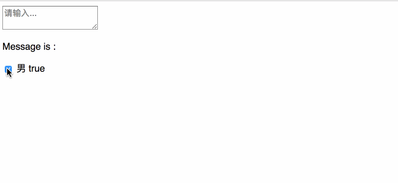

### Vue2 表单输入绑定

#### 文本

```vue
<script>
    new Vue({
        el: '#app',
        data: {
            message: ''
        }
    })
</script>
```

```vue
<div id="app">
    <input type="text" v-model="message" placeholder="请输入...">
    <p>Message is : {{ message }}</p>
</div>
```

#### 多行文本

```vue
<div id="app">
    <textarea v-model="message" placeholder="请输入..."></textarea>
    <p>Message is : {{ message }}</p>
</div>
```


#### 复选框

```vue
<input id="checkbox" type="checkbox" v-model="check"/> 男
<label for="checkbox">{{ check }}</label>
```

```vue
<script>
    new Vue({
        el: '#app',
        data: {
            message: '',
            check: true
        }
    })
</script>
```



多个复选框绑定到同一个数组中

```vue
<input type="checkbox" id="zhangsan" value="张三" v-model="checkedNames">
<label for="zhangsan">张三</label>
<input type="checkbox" id="lisi" value="李四" v-model="checkedNames">
<label for="lisi">李四</label>
<input type="checkbox" id="wangwu" value="王五" v-model="checkedNames">
<label for="wangwu">王五</label>
<span>选中的名称：{{checkedNames}}</span>
```

```vue
<script>
    new Vue({
        el: '#app',
        data: {
            checkedNames:[]
        }
    })
</script>
```

#### 单选按钮

```vue
<input type="radio" id="male" value="男" v-model="checkedSex"/>
<label for="male">男</label>
<input type="radio" id="female" value="女" v-model="checkedSex"/>
<label for="female">女</label>
<span>选中的性别：{{ checkedSex }}</span>
```

```vue
<script>
    new Vue({
        el: '#app',
        data: {
            checkedSex:''
        }
    })
</script>
```

#### 下拉选择框

```vue
<select v-model="selected">
    <option disabled value=''>请选择</option>
    <option value="北京">北京</option>
    <option value="天津">天津</option>
    <option value="上海">上海</option>
    <option value="广州">广州</option>
    <option value="杭州">杭州</option>
</select>
<span>下拉框选中的是：{{ selected }}</span>
```


------


#### 修饰符

- **.lazy**

  在默认情况下，`v-model` 在每次 `input` 事件触发后将输入框的值与数据进行同步。你可以添加 `lazy` 修饰符，从而转变为使用 `change` 事件进行同步：

  简单来说就是加了 `.lazy` 就是在你输入完成后将输入框的值与数据同步，而不是监听你的输入的过程。

  ```vue
  <!-- 在 'change' 时而非 'input' 时更新 -->
  <input type="text" v-model.lazy='msg'/>
  ```

- **.number**

  自动将用户的输入值转为数值类型，可以给 `v-model` 添加 `number` 修饰符

  ```vue
  <input v-model.number="age" type="number"/>
  ```

- **.trim**

  自动过滤用户输入的首尾空白字符串。

  ```vue
  <input v-model.trim="msg"/>
  ```

