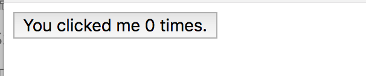
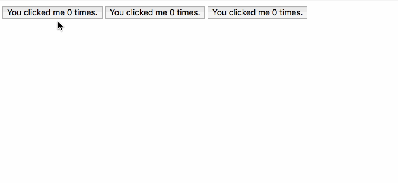

### 组件的基础知识

还记得怎么定义全局组件的么？

```vue
// 定义了一个全局组件，名称叫 hello
Vue.component('hello', {
    template: '<button v-on:click="count++">You clicked me {{ count }} times.</button>',
    data: function() {
        return {
            count: 0
        }
    }
});
```

组件是可以复用的 `Vue` 组件，并且带有一个名字。上面这个例子中的组件名称就是 `<hello></hello>`，我们可以在 `new Vue({el: '#app'})` 创建的根实例中应用它，把这个组件作为自定义元素来使用。如下：

```vue
<div id="app">
    <hello></hello>
</div>
```



因为组件是可复用的 `Vue` 实例，所以它们与 `new Vue` 接收相同的选项，例如 `data`、`computed`、`watch`、`methods` 以及生命周期钩子等。

**仅有的例外是像 `el`这样根实例特有的选项。**


#### 组件的复用

一个组件被定义好之后，你可以进行任意次的复用。例如：

```vue
<div id="app">
    <hello></hello>
    <hello></hello>
    <hello></hello>
</div>
```

每个组件都会各自独立维护它的 `count`。因为你每用一次组件，就会有一个它的新**实例**被创建。



> **另外：注意，组件中的 data 必须是一个函数，因此每个实例可以维护一份被返回对象的独立的拷贝。**

以前我们的写法：

```vue
// 不返回函数的话，可能会导致改变一个地方将会影响其他的实例
data: {
  count: 0
}
```

```vue
data: function () {
  return {
    count: 0
  }
}
```


#### 组件的组织

组件通常会以一棵树的形式来组织。类似这样：


其中有少部分内容是可以复用的。但是为组件能够在模板中使用，这些组件就必须先注册以便 `Vue` 能够被识别。


组件的注册类型分为两种：**全局注册** 和 **局部注册**。

使用 `Vue.component('my-component', {})` 这种方式注册的都是全局注册。


全局注册的组件在任何 `Vue` 的实例中都是可以被使用的。


#### 通过 Props 向子组件传递数据

`props` 是你可以在组件上注册的一些自定义特性。当一个值传递给一个 `prop` 特性的时候，它就变成了那个组件实例的一个属性。为了给博文组件传递一个标题，我们可以用一个 `props` 选项将其包含在该组件可接受的 prop 列表中。例如：

```vue
Vue.component('my-component',{
    props:['title'],
    template: '<h1>{{ title }}</h1>'
});
```

组件 `my-component` 就拥有了 `title` 这个属性。

```vue
<div id="app">
   <my-component title="标题一"></my-component>
   <my-component title="标题二"></my-component>
   <my-component title="标题三"></my-component>
</div>
```


这只是简单的写法。当然在实际的应用中，我们的数据不可能如此简单。你可能会在 `data` 节点中有一个数组数据。

```vue
<div id="app">
   <blog-post v-for="post of posts"
                 :key="post.id"
                 :city="post.title"></blog-post>
</div>
```

```vue
<script>
    Vue.component('blog-post',{
        props:['title'],
        template: '<h3>{{ title }}</h3>'
    });
    new Vue({
        el: "#app",
        data:{
            posts: []
        },
        // vue 实例被创建的时候，请求数据
        created: function(){
            console.log('vue 实例已经被创建');
            var vm = this;
            fetch('https://cnodejs.org/api/v1/topics')
                .then(function(response){
                    return response.json()
                })
                .then(function(data){
                    vm.posts = data
                })
        }
    })
</script>
```

