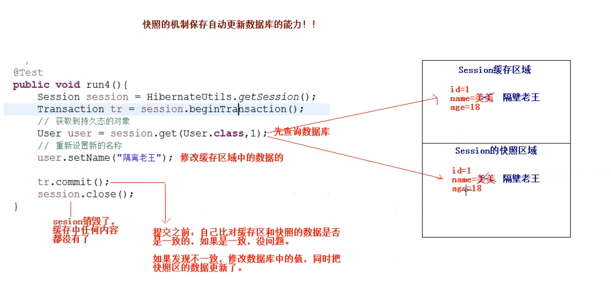

# Hibernate 持久化类

> `java` 类与表建立了映射关系就是持久化类
> 
> 持久化类 = `JavaBean` + `xxx.hbm.xml`
> 
> 


# 一、主键的生成策略

### 1. `increment`: 适用于 `short`，`int`，`long` 作为主键，但是不是使用数据库的自动增长机制。

获取主键的最大值，将 `最大值 + 1` 作为下一次的主键。保存用户通过控制台可以看到下面的输出语句，得以验证。

```
select max(id) from user;
```

**并发访问会出问题，也就是多线程情况下有问题。**

### 2. `identity`：适用于 `short`， `int`，`long` 作为主键。但是这个必须使用在有自动增长的数据库中，采用的是数据库底层的自动增长机制。

> 底层使用的是数据库的自动增长`（auto_increment）`，像 `Oracle` 这样的数据库没有自动增长。


### 3. `sequence`：适用于 `short`， `int`，`long` 作为主键。底层使用的是序列的增长方式。

> `Oracle` 数据库底层没有自动增长，想自动增长需要使用序列。

### 4. `uuid`：适用于 `char`， `varchar` 类型的作为主键
> 使用随机的字符串作为主键。


### 5. `native`：本地策略，根据底层的数据库不同，自动选择适用于该数据库的生成策略。（`short`， `int`， `long`）
> 如果底层使用的 `MySQL` 数据库，相当于 `identity`
> 
> 如果底层使用的是 `Oracle` 数据库，相当于 `sequence`


### 6. `assigned`：主键不用 `hibernate` 管理了，自己指定主键。


**一般情况下，我们只会使用两个，如果是整型，使用 `native`，如果使用字符串，那么就使用 `uuid`。**

----
# 二、三个状态

### 1. 瞬时态
通过 new 关键字获得

```
Person p = new Person();
//由于主键是交给 hibernate 管理的，通过 new 关键字生成瞬时态的对象的时候，还没有生成 id， 故此时的 p 就是瞬时态。简单来说就是还有没 session 纳入管理。
```

> 瞬时 -> 持久（通过 `save` 或者 `saveOrUpdate` 方法）


### 2. 持久态

有 `id`， 被 `session` 管理。

> **注意：持久态有自动更新数据库的能力。**


```
@Test
public void run1(){
    Session session = HibernateUtils.getSession();
    Transaction transaction = session.beginTransaction();

    //获取到持久太态对象
    // user 是持久态对象，有自动更新数据库能力
    User user = session.get(User.class, 1L);
    
    user.setName("德玛西亚");
    
    //正常流程
    //session.update(user);
    
    transaction.commit();
    session.close();
    
}

```
不调用 `update` 数据库也能被修改。**原因： 一级缓存。**


### 3. 托管态

没有被 `session` 管理，有 `id`

----

# 三、`Session` 对象的一级缓存

### 1. 什么是缓存？
一块内存空间，将数据源（数据库或者文件）中的数据存放到缓存中，再次获取的时候，直接从缓存中获取，以便于提升程序的性能。

### 2. `Hibernate` 提供了两种缓存
**一级缓存：**自带的不可卸载的，`Session` 是一级缓存，生命周期比较短暂。通常称为：`Session` 级别的缓存。

**二级缓存：**默认没有开启，需要手动配置才能使用。二级缓存可以在多个 `Session` 中共享数据，`SessionFactory` 是二级缓存，是为了增强一级缓存的功能。通常称为：`SessionFactory` 级别的缓存。


### 3. 证明缓存存在

证明缓存存在，只需要在一个 `Session` 中查询两次同一个对象，看控制台输出的几条 `sql` 语句即可。

```
@Test
public void run2(){
    Session session = HibernateUtils.getSession();
    Transaction transaction = session.beginTransaction();

    User user = new User();
    user.setName("小花");
    user.setSex("男");
    //user 被放入缓存了。
    Serializable id = session.save(user);

    User user1 = session.get(User.class, id);
    System.out.println(user1);

    transaction.commit();
    session.close();
}
```

看控制台输出，`sql` 语句只输出了一条，说明第二次的查询是从缓存中获取的。更简便的证明：查询同一个对象两次，看看输出几条 `sql` 语句。


### 4. `Hibernate` 使用快照机制保证持久态的对象自动更新数据库的能力



----
# 四、事务概念

### 1. 事务
事务就是逻辑上的一组操作，组成事务的各个执行单元，操作要么全都成功，要么全都失败。例如：银行转账。

### 2. 事务的特性

**1. 原子性：** 事务不可分割

**2. 一致性：** 事务执行的前后数据的完整性保持一致

**3. 隔离性：** 一个事务执行的过程中，不应该受到其他的事务的干扰。（并发访问的问题）

**4. 持久性：** 事务一旦被提交，数据就永久保持到数据库中

### 3. 如果不考虑隔离性，会引发一些读的问题

**1. 脏读：** 一个事务读到了另一个事务未提交的数据

**2. 不可重复读：** 一个事务读到了另一个事务已经提交的 `update` 数据，导致多处查询的结果不一致。

**3. 虚读：** 一个事务读到了临近一个事务已经提交的 `insert` 数据，导致多次查询结果不一致。

> 在一个事务中，不管查询多少次，结果都应该是一样的。


### 4. 通过设置数据库的隔离级别来解决上述问题
`hibernate` 框架提供了设置隔离级别的方式，需要在 `hibernate.cfg.xml` 中配置

**通过： `hibernate.connection.isolation = 4` 来配置， `hibernate` 默认就是 `4`**，一般情况下只需要维持默认即可，隔离级别设置过高会导致程序效率过低的问题。


取值

> 1  Read uncommitted isolation 
> 
> 2  Read committed isolation
> 
> 4  Repeatable read isolation
> 
> 8  Serializable isolation
> 
> 一般不用 `1` 和 `8`


----
# 五、丢失更新

```
在 javaBean 中添加一个 version 字段
<!-- 乐观锁 -->
<version name="version"/>
```


# 六、绑定本地 Session

`ThreadLocal` 类，底层是用 `Map` 集合来实现的。

```
Map<"当前的线程", 值>
map.put("当前线程"， 值1);
map.get("当前线程");

```


在 `hibernate.cfg.xml` 配置文件中添加

```
<!-- 开启绑定本地 session-->
<property name="hibernate.current_session_context_class">thread</property>
```

工具类 `HibernateUtils` 中更改方法

```
/**
 * 业务层开事务
 * @return
 */
public static Session getCurrentSession(){
    return sessionFactory.getCurrentSession();
}

```

不用关闭，线程关闭的时候，会自动关闭。


