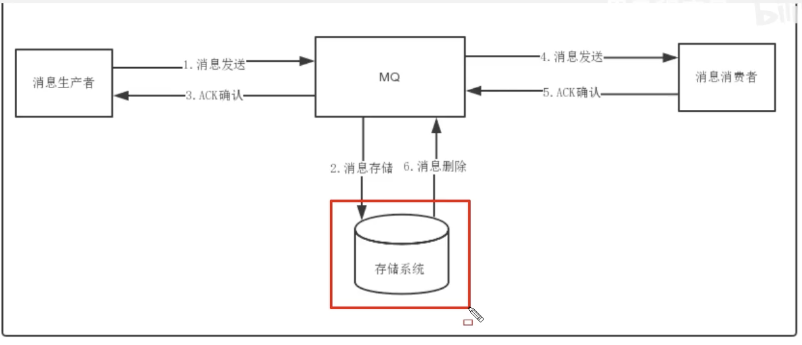
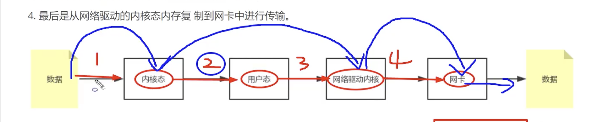
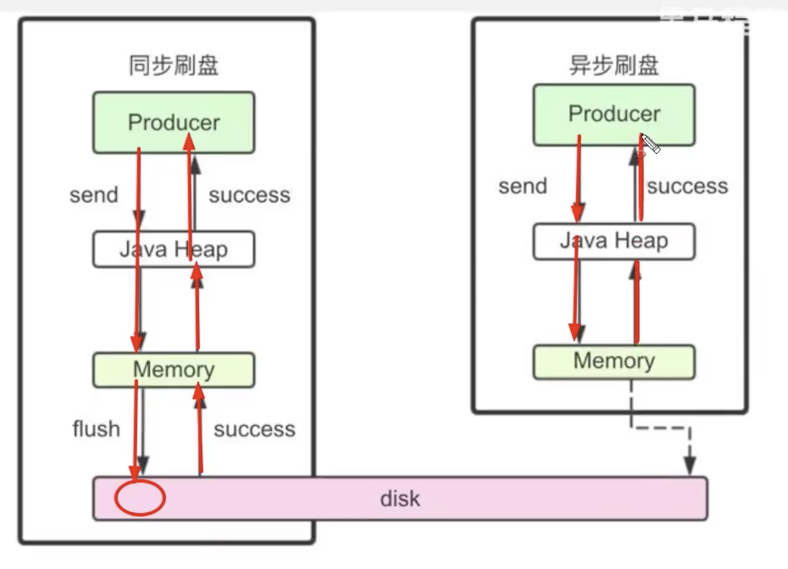
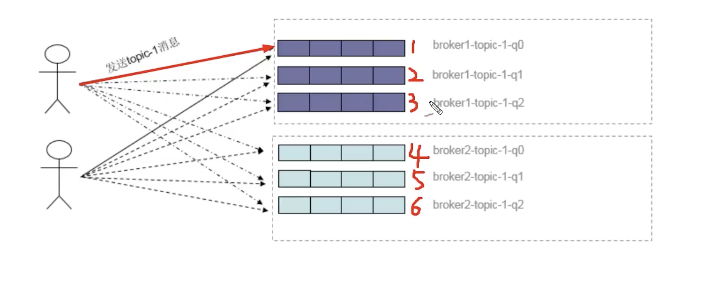

## 消息存储

分布式队列因为有高可靠性的要求，所以数据要进行持久化存储。



存储介质：

- 关系型数据库，（ActiveMQ 就是采用的 DB 做消息存储），可选用 JDBC 做数据持久化
- 文件系统：（RocketMQ、Kafka、RabbitMQ）

性能方面

文件系统 > 关系型数据库


RocketMQ 采用了顺序写磁盘，保证了存储速度

#### 消息发送

Linux 操作系统分为「用户态」和「内核态」，文件操作、网络操作需要涉及这两种形态的切换，避免不了进行数据复制。一台服务器把本机磁盘文件的内容发送到客户端，一般有几个步骤：

1. read：读取本地文件内容
2. write：将读取的内容通过网络发送出去

这两个看似简单的操作，实际上进行了 4 次数据复制，分别是：

1. 从磁盘复制数据到内核态内存
2. 从内核态内存复制到用户态内存
3. 然后从用户态内存复制到网络驱动的内核态内存
4. 最后从网络驱动的内核态内存付指导网卡中进行传输



零拷贝，一般 1.5G-2G，这也就是为啥 RocketMQ 的 CommitLog 默认配置为 1G

- CommitLog：存储消息的元数据。
- ComsumerQueue：存储消息在 CommitLog 的索引
- indexFile：查询消息索引，通过 Key 或者时间戳来查询


#### 刷盘机制



- 同步刷盘机制
  - 在返回写成功状态时，消息已经被写入磁盘。具体流程是，消息写入内存的 PAGECACHE 后，立刻通知刷盘线程刷盘，然后待刷盘完成，刷盘线程执行完成后唤醒等待的线程，返回消息写成功的状态。

- 异步刷盘机制

  - 在返回写成功状态时，消息可能只是被写入了内存的 PAGECACHE，写操作的返回快，吞吐量大；当内存里的消息量积累到一定程度时，统一出发写磁盘动作，快速写入

- 配置

  - ```java
    @ImportantField
    private FlushDiskType flushDiskType = FlushDiskType.ASYNC_FLUSH;  //异步刷盘
    ```


## 负载均衡

Producer 负载均衡



Producer 端，每个实例都在发消息的时候，默认会轮询所有的 Message Queue 发送，以达到让消息平均落在不同的 queue 上，而由于 queue 可以散落在不同的 broker，所以消息就发送到了不同的 broker 下。

RocketMQ 默认实现了轮询的方式


Consumer 负载均衡

- 集群模式
- 广播模式


