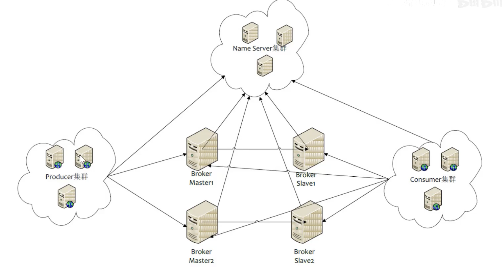
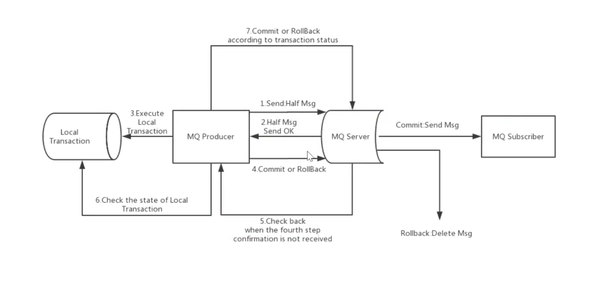

## RocketMQ 集群搭建

#### 角色介绍

- Producer：消息的发送者；举例：发信者
- Consumer：消息接收者；举例：收信者
- Broker：暂存和传输消息；举例：邮局
- NameServer：管理 Broker；举例：各个邮局的管理机构
- Topic：区分消息的种类；一个发送者可以发送一个消息或者多个 Topic；一个消息的接收者可以订阅一个或者多个 Topic 消息；
- Message Queue：相当于是 Topic 的分区，用于并行发送和接受消息




## 集群搭建方式

- NameServer 是一个无状态的节点，可以集群部署，节点之间无任何信息同步
- Broker 部署相对复杂，Broker 分为 Master 与 Slave，一个 Master 可以对应多个 Slave，但是一个 Slave 只能对应一个 Master，Master 与 Slave 的对应关系通过指定相同的 BrokerName，不同的 BrokerId 来定义。BrokerId 为 0 表示为 master，非 0 表示 Slave。Master 也可以部署多个。每个 Broker 与 NameServer 集群中的所有节点建立长连接，定时注册 Topic 信息到所有的 NameServer。
- Producer 与 NameServer 集群中的其中一个节点（随机选择）建立长连接，定期从 NameServer 中取 Topic 路由信息，并向提供 Topic 服务的 Master 建立长连接，且定时向 Master 发送心跳。Producer 完全无状态，可集群部署。
- Consumer 与 NameServer 集群中的其中一个节点（随机选择）建立长连接，定期从 NameServer 中取 Topic 路由信息，并向提供 Topic 服务的 Master、Slave 建立长连接，且定时向 Master、Slave 发送心跳。Consumer 既可以从 Master 订阅消息，也可以从 Slave 订阅消息。订阅规则由 Broker 配置决定。


## 集群模式

#### 单 Master 模式

风险比较大，一旦 Broker 重启或者宕机，会导致整个服务不可用。

#### 多 Master 模式

一个集群无 Slave，全是 Master，例如两个 Master 或者三个 Master。这种模式有利有弊：

- 优点：配置简单，单个 Master 宕机或者重启维护对应用无影响，在磁盘配置为 RAID10 时，即使机器宕机不可恢复的情况下，由于 RAID10 磁盘非常可靠，消息也不会丢失（异步刷盘丢失少量消息，同步刷盘一条不丢），性能最高。
- 缺点：单台机器宕机期间，这台机器上未被消费的消息在机器恢复之前不可订阅，消息实时性会受到影响。

#### 多 Master 多 Slave 模式（异步）

每个 Master 配置一个 Slave，有多对 Master-Slave，HA 采用异步复制方式，主备有短暂延时（毫秒级），这种模式的优缺点如下：

- 优点：即使磁盘损坏，消息丢失非常少，且消息实时性不会受影响，同时 Master 宕机后，消费者仍然可以从 Slave 消费，且过程对应用透明，不需要人工干预，性能同多 Master 模式几乎一样；
- 缺点：Master 宕机，磁盘损坏的情况下会丢失少量消息。

#### 多 Master 多 Slave 模式（同步）

每个 Master 配置一个 Slave，有多对 Master-Slave，HA 采用同步双写方式，即只有主备都写成功，才向应用返回成功。这种模式的优缺点如下：

- 优点：数据域服务都无单点故障，Master 宕机的情况下，消息无延迟，服务可用性与数据可用性都非常高
- 缺点：性能比异步赋值模式略低，发送单个消息的 RT 会略高，且目前版本在主节点宕机后，备机不能自动切换为主机。


## RocketMQ 实现顺序发送

发送时：

```java
producer.send(Message, new MessageQueueSelector() {
	
  /**
   * mqs 队列集合
   * msg 消息对象
   **/
	@Override
	public MessageQueue select(List<MessageQueue> mqs, Message msg, Object arg){
	
	}
});
```

```java
//消息队列选择器
public interface MessageQueueSelector {
    MessageQueue select(final List<MessageQueue> mqs, final Message msg, final Object arg);
}
```

发送消息时，内部实现 MessageQueueSelector 接口，实现匿名内部类的 select 方法，可以选择发送到哪一个队列中，实现顺序消费。

消费时：

```java
consumer.registerMessageListener(new MessageListenerOrderly() {
  @Override
  public ConsumerOrderlyStatus consumeMessage(List<MessageExt> msgs, ConsumeOrderlyContext context) {
    
    return ConsumerOrderlyStatus.SUCCESS;
  }
});
```

`MessageListenerOrderly` 只会开一个线程去消费指定队列里面的消息。

```java
/**
 * A MessageListenerConcurrently object is used to receive asynchronously delivered messages orderly.one queue,one
 * thread
 * 只会开启一个线程顺序消费一个队列里面的消息
 */
public interface MessageListenerOrderly extends MessageListener {
    /**
     * It is not recommend to throw exception,rather than returning ConsumeOrderlyStatus.SUSPEND_CURRENT_QUEUE_A_MOMENT
     * if consumption failure
     *
     * @param msgs msgs.size() >= 1<br> DefaultMQPushConsumer.consumeMessageBatchMaxSize=1,you can modify here
     * @return The consume status
     */
    ConsumeOrderlyStatus consumeMessage(final List<MessageExt> msgs,
        final ConsumeOrderlyContext context);
}
```


## 延迟发送

RocketMQ 支持延迟发送，但是默认只支持指定的几个级别，最大支持 2 个小时。

```java
msg.setMessageDelayLevel("2"); //延迟 5s 中
```

```java
/**
 * 消息相关的默认配置在 com.alibaba.rocketmq.store.config.MessageStoreConfig 中
 **/
// 定时消息相关
private String messageDelayLevel = "1s 5s 10s 30s 1m 2m 3m 4m 5m 6m 7m 8m 9m 10m 20m 30m 1h 2h";
```

**一个消息默认大小为 512K**

```java
// 最大消息大小，默认512K
private int maxMessageSize = 1024 * 512;
```


## 过滤

- 通过 Tag 过滤

- 通过 SQL 过滤

  ```java
  message1.putUserProperty("i", MessageSelector.bySql("i > 5"));
  message1.putUserProperty("i", MessageSelector.byTag(""));
  ```


## 事务消息



两个流程

- 正常的事务消息的发送及提交
- 事务消息的补偿流程

```java
TransactionMQProducer mqProducer = new TransactionMQProducer("group");
//设置事务监听器
mqProducer.setTransactionListener(new TransactionListener() {
  //执行本地事务
  @Override
  public LocalTransactionState executeLocalTransaction(org.apache.rocketmq.common.message.Message msg, Object arg) {
    String tags = msg.getTags();
    if("TAGA".equals(tags)){
      //提交事务
      return LocalTransactionState.COMMIT_MESSAGE;
    } else if("TAGB".equals(tags)){ //回滚消息
      return LocalTransactionState.ROLLBACK_MESSAGE;
    } else {
      //让 RocketMQ 回查生产者消息
      return LocalTransactionState.UNKNOW;
    }
  }

  //回查完毕后执行
  @Override
  public LocalTransactionState checkLocalTransaction(MessageExt msg) {
    String tags = msg.getTags();
    //回查完毕后提交事务
    return LocalTransactionState.COMMIT_MESSAGE;
  }
});
mqProducer.sendMessageInTransaction(message1, null);
```


